# Azure - Windows virtual machines

## Purpose

At the end of this module, you will:
* Create a Windows virtual machine using the Azure portal
* Connect to a running Windows virtual machine using Remote Desktop
* Install software and change the network configuration on a VM using the Azure portal

## Creating a new Windows virtual machine

We can create Windows VMs with the Azure portal, Azure CLI, or Azure PowerShell. The easiest approach is the portal because it walks you through the required information and provides hints and helpful messages during the creation of the VM.

### ![Building a Windows VM][activity] 2.10.1 Building a Windows VM

1. On the Azure portal menu (top left menu icon), select Create a resource.

1. Select the See all link next to the Azure Marketplace heading. This option displays all available images on the Azure Marketplace.

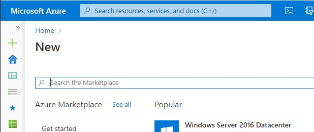

4. Select Microsoft from the Publisher filter options. 

5. In the search box, type Windows Server and then press enter.

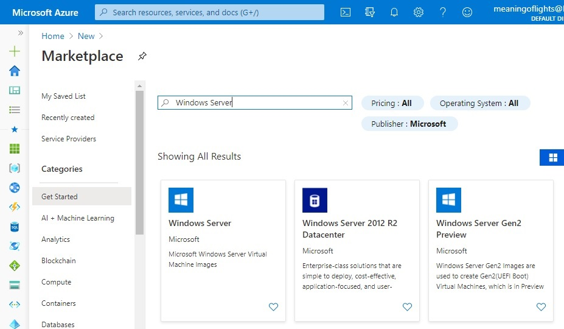

6. There are several Windows Server versions we can select to create our VM. Choose Windows Server, then accept "[smalldisk] Windows Server 2019 Datacenter" option or "Windows Server 2019 Datacenter". Either is OK. Try the cheapest the Pricing dropdownlist.

7. Click the Create button to start configuring the VM.

## Azure Portal to configure the VM settings

The VM creation experience in the portal is presented in a "wizard" format to walk you through all the configuration areas. Clicking the "Next" button will take you to the next configurable section. You can move between the sections with the tabs running across the top.

#### 2.10.2 Configure the VM settings

1. Select the Subscription that should be billed for VM hours.

1. For Resource group, create a new one called: AzureTraingingExercise1

1. In the Instance Details section, enter a name for your VM, such as NCGWIDA0001 (for Windows Internal Desktop Application).

> It's best practice to standardise your resource names so you can easily identify their purpose. Windows VM names are a bit limited - they must be between 1 and 15 characters, cannot contain non-ASCII or special characters, and must be unique in the current resource group.

4. Select Australia Southeast region.

5. Leave Availability options as "No Infrastructure redundancy required". This option is used to ensure the VM is highly available by grouping multiple VMs together a set to deal with planned or unplanned maintenance events or outages.

6. Leave image set to "Windows Server 2019 Datacenter". You can open the drop-down list to see all the options available.

7. Click the Change size link to explore other VM sizes:

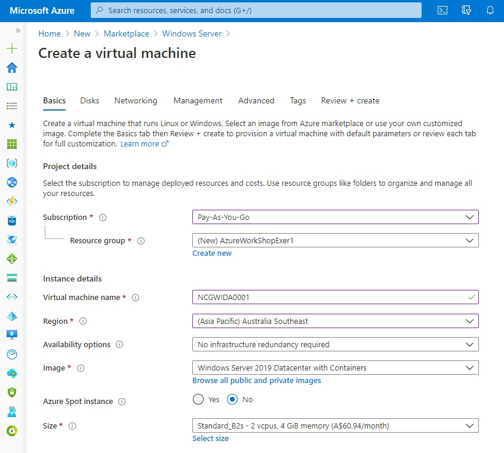

8. In the Administrator Account section below, set the Username field to a username you will use to sign in to the VM such as your first name.

> In the Password field, enter a password that's at least 12 characters long. It must have three of the following: one lower case character, one uppercase character, one number, and one special character that is not '\' or '-'. Use something you will remember or write it down, you will need it later.

9. Confirm the password. eg Password555!!!

10. In the Inbound Port Rules section, open the list and choose Allow selected ports. Since this is a Windows VM, we want to be able to access using RDP. Have a look in the list and you'll find RDP (3389). 

> Note: We can adjust the network ports after we create the VM.

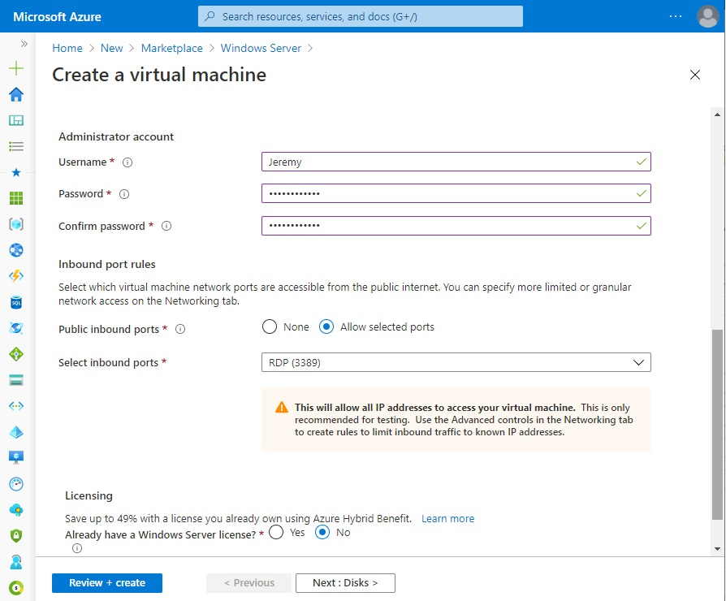


#### 2.10.3 Configure Disks for the VM

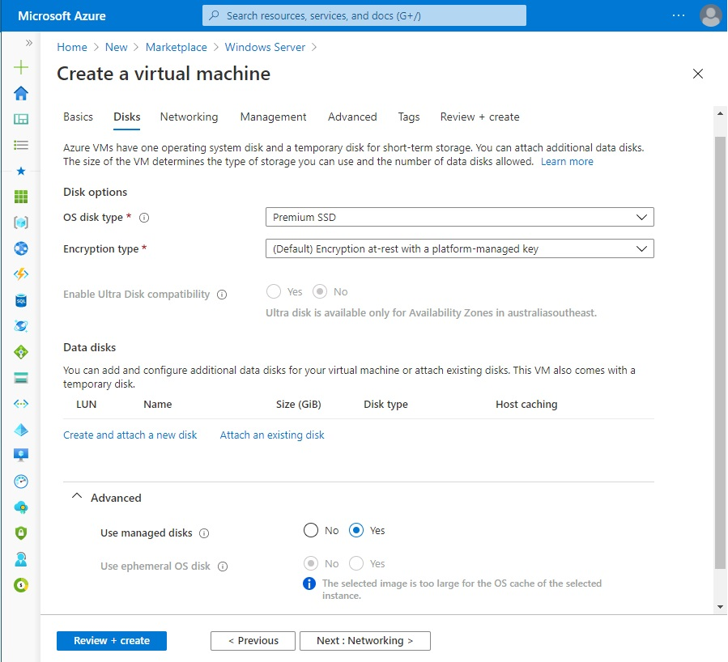

1. Click Next to move to the Disks section.

> By default we get an OS disk (C:) and Temporary disk (D:). Let's add a data disk as well.

2. Expand Advanced and select the radio button "Use managed disks" so we don't have to work with storage accounts. You can flip the switch to see the difference in information that Azure needs if you like.

3. Click the Create button and attach a new disk link in the DATA DISKS section.

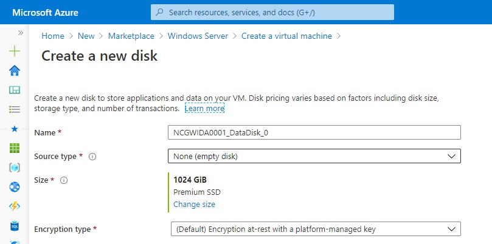

4. You can take all the defaults: Premium SSD, 1023 GB, and None (empty disk); although notice we could use a snapshot, or Storage Blob to create a VHD.

5. Click OK to create the disk and go back to the DATA DISKS section.

6. There should now be a new disk in the first row.


#### 2.10.4 Configure the Network

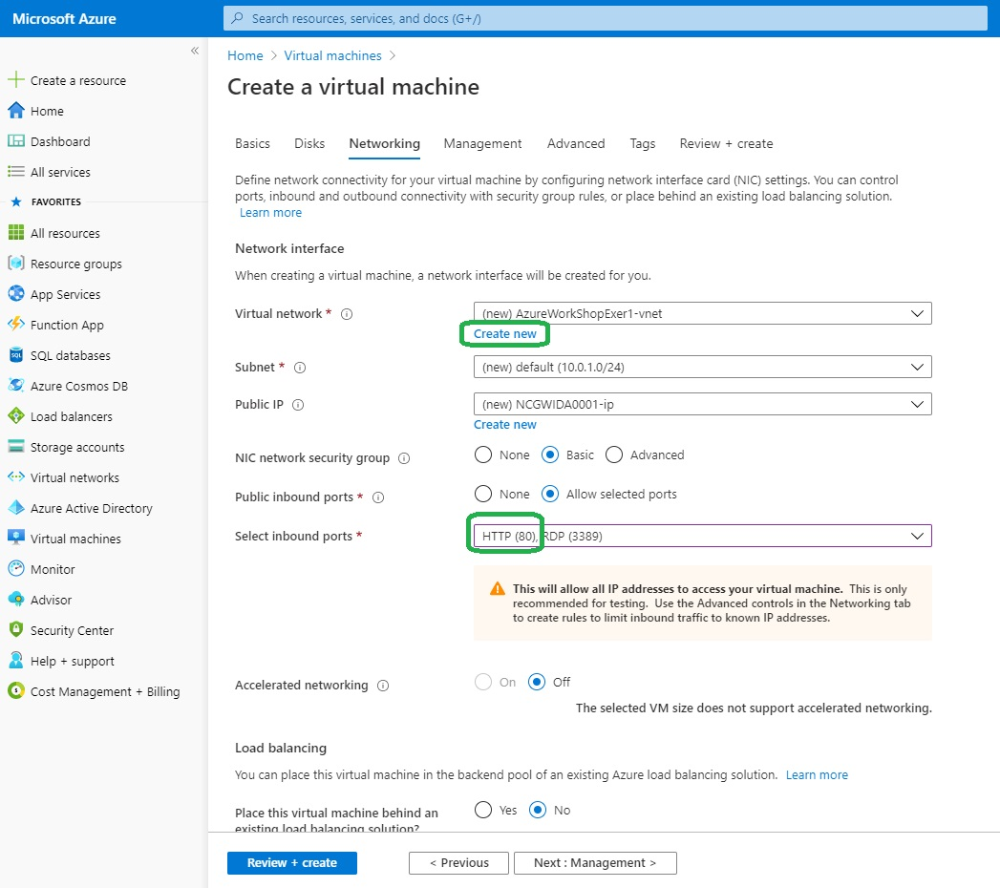

1. Click Next to move to the Networking section.

1. In a production system where we already have other components we want to utilize an existing virtual network. This way our VM can communicate with the other cloud services in our solution. If there isn't one defined in this location we can create and configure it here.

* Address space: the overall IPV4 space available to this network.
* Subnet range: the first subnet to subdivide the address space - it must fit within the defined address space. Once the VNet is created, you can add additional subnets.
 
3. Let's change the default ranges to use the 172.xxx IP address space. Click Create New under Virtual Network.

4. Change the Address space field to be 172.16.0.0/16 to give it the full range of addresses

5. Change the Subnet range field to be 172.16.1.0/24 to give it 256 IP addresses of the space.

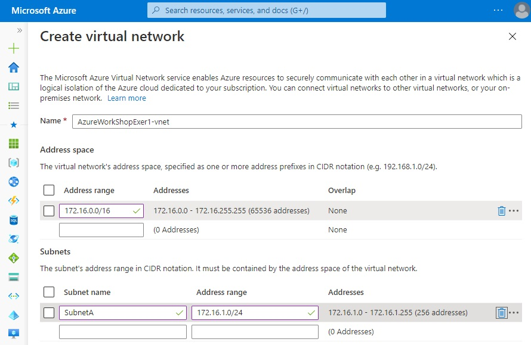

6. Click OK.

7. Set the Select inbound ports to allow Port 80 as well as port 3389.

> By default, Azure will create a virtual network, network interface, and public IP for your VM. PLease note it is not trivial to change the networking options after the VM has been created so always double-check the network assignments on services you create in Azure.

#### 2.10.5 VM Management

1. Leave all the defaults. Typically we would turn off Boot Diagnostics as it will create a boot log file in a Storage account. Although in the next module #1.15 we need it turned on. Please read these instructions and leave it on!

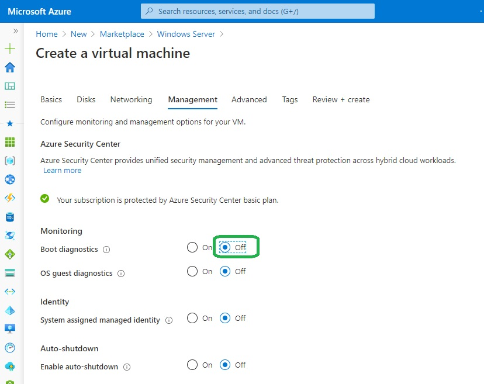

## Finish configuring the VM and create the image

1. The rest of the options have reasonable defaults and there's no need to change any of them. You can explore the other tabs if you like. The fields have an (i) icon next to them that will show a helpful bubble tooltip to further explain the option. This is a great way to learn about the various features you can use to configure the VM.

1. Click the Review + create button at the bottom of the panel. 

1. The system will validate your options and give you details about the VM being created.

4. Click Create to create and deploy the VM. The Azure dashboard will show the VM being deployed. This may take several minutes. Copy the Public IP Address.

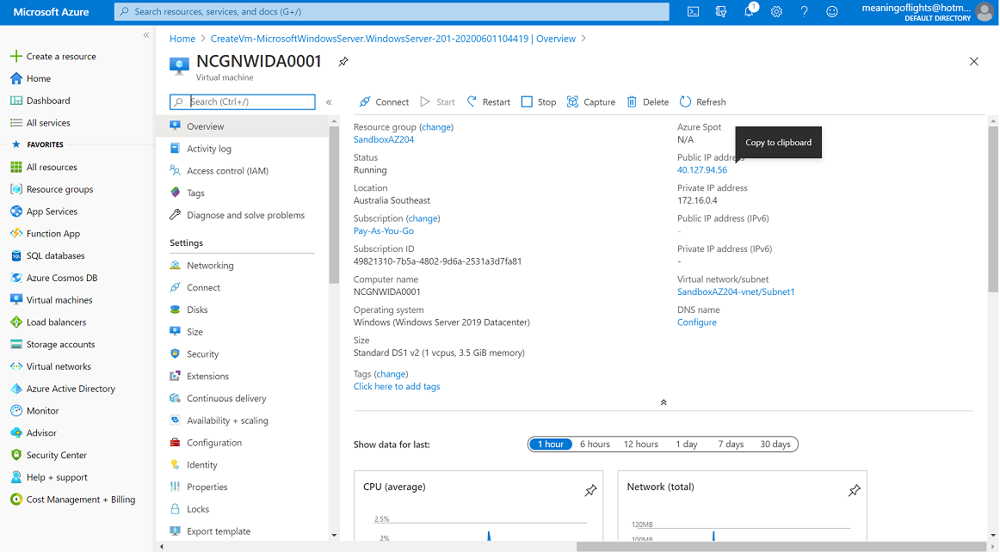

#### 2.10.6 Login to the VM

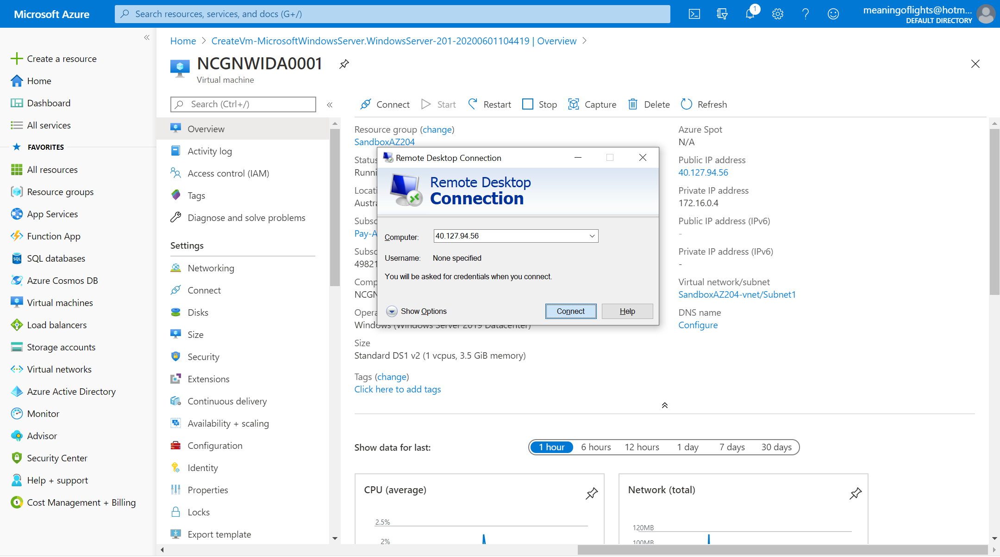

1. Click Start > Run > and type 

```
MSTSC
```

1. In the Remote Desktop Protocol login window paste the IP Address of the VM you copied previously.

1. When prompted enter the username and password you used when you created the VM.

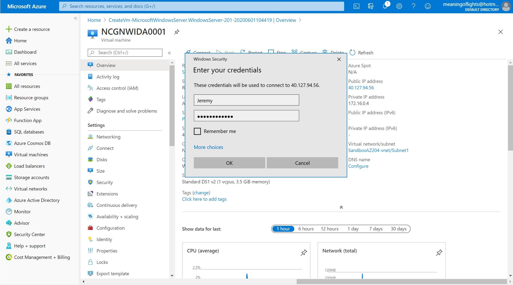

#### 2.10.7 Installing IIS

1. Once logged in to the VM, open Server Manager.

1. Click "2. Add Roles and Features".

1. Next > Next > Next > choose Web Server (IIS) > click Add Features.

1. Next > Next > Next > Next > Install.

1. Open IE inside the VM and Browse to http://localhost and you should see Internet Information Services home page.

1. Since we enabled port 80 we can visit the default IIS Website using the IP Address of our VM into a Web Browser. Make sure you use a Web Browser outside your VM and paste in the VMs IP Address.

That completes setting up a Windows VM that we will use in further exercises.


### ![Reading][reading] Further Reading

These additional resources are also useful.

* [Create a Windows virtual machine in Azure](https://docs.microsoft.com/en-gb/learn/modules/create-windows-virtual-machine-in-azure/)


[activity]: ../icons/activity.png "Workshop Activity!"
[discussion]: ../icons/discussion.png "Team Discussion!"
[reading]: ../icons/reading.png "Further Reading!"
