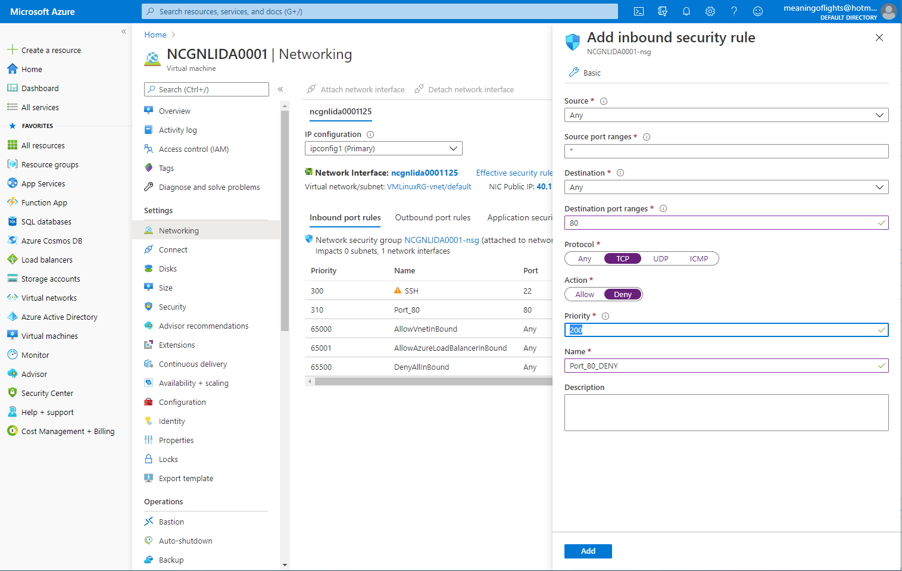

# Azure - Network Security Groups

## Purpose

At the end of this module, you will:
* Understand how Network Security Groups can allow or deny network traffic
* Understand the options that are available for configuring Network Security Groups

### ![Buildinig a Network Security Group][activity] 2.30.1 Buildinig a Network Security Group

In this activity we will learn about the default Network Security Groups and see how we can setup them up ourselves. We will continue on withour Linux VM.

#### 2.30.2 Default Network Security Groups

1. In Azure Portal click on the Networking sub menu and notice we have rules for both inbound and outbound traffic and by default there are three rules in place (65000, 65501, 65500).

These rules  (65000, 65501, 65500) can't be deleted or modified.

* The first rule allows for all access within a virtual network.
* The second rule allows access from a load balancer onto virtual machines.
* And the last rule denies all other traffic.

#### 2.30.3 Additional Network Security Groups

In the previous exercise we configured two rules when we setup the VM to allow SSH access and public website internet access over port 22:

* Port 22 (SSH Access).
* Port 80 (Browse HTTP).

When defining these rules we need to take security into perspective. To restrict anyone connecting to the virtual machine let's be a bit more specific and edit the port 22 rule: 

1. Edit the SSH port 22 InBound Security Rule.

1. Google the IP Address of your machine http://google.com/search?q=my+ip+address

1. In the Source, set the IP address to your laptop or your workstation, replacing Source Any *.

1. In the Destination select the virtual network and then click on save.

> Here we are making the remote desktop access more secure by restricting it to our IP address (instead of Any IP address) allowing only us to access the Virtual Network (instead of Any destination).

#### 2.30.4 Priority

1. The Priority is how the rules get evaluated. To demonstrate this let's add an inbound port rule and set the Source as any the Destination as any and the port range has 80 with a DENY.

2. Put the protocol as TCP.

3. Put the action has **Deny**.

4. Set it as a low priority rule, eg **200**, this is important is a low rule number to be pioritised and evaluated first. 

5. Click on Add.

6. We now have a rule at the top of our list to deny traffic on port 80 for this virtual machine.

7. Take the public IP address, not in chrome or FF but open another browser (that hasn't cached the page) and you will see you can't reach the page.

So when the request comes to our virtual machine it is evaluated in order of priority. Also note that Network Security Groups can double as Network Access Control Lists (NACLs) in they can allow or deny traffic at the Subnet or the VM level.

9. Lastly remove the Network Security Group Denying Port 80 so that we can reach the server's MGINX website.

That completes this chapter on the basics of network security groups.

[activity]: ../icons/activity.png "Workshop Activity!"
[discussion]: ../icons/discussion.png "Team Discussion!"
[reading]: ../icons/reading.png "Further Reading!"
