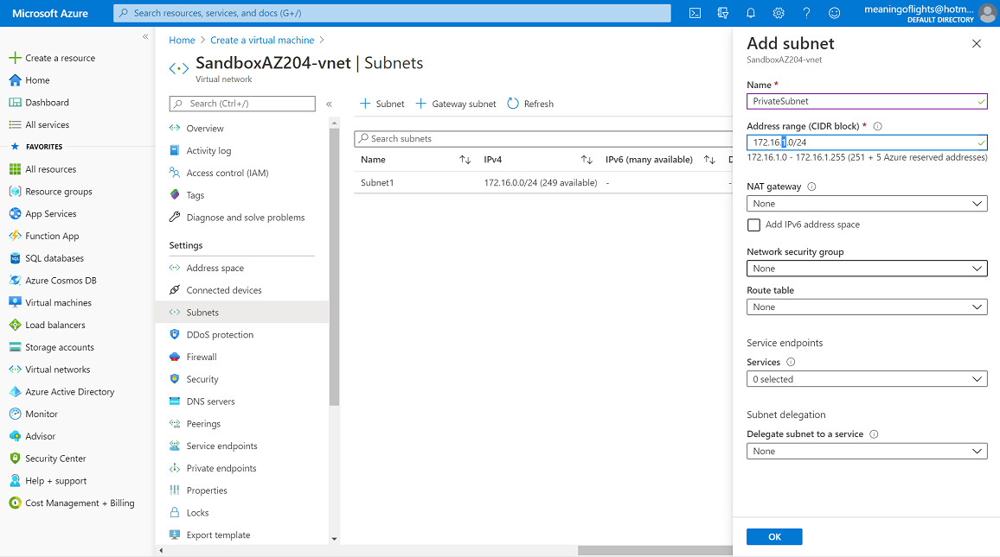
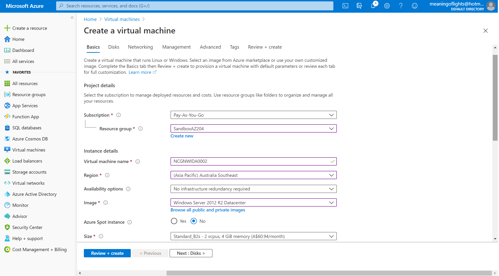
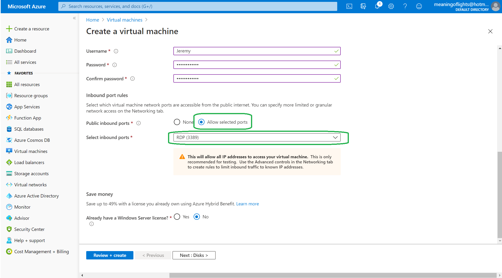
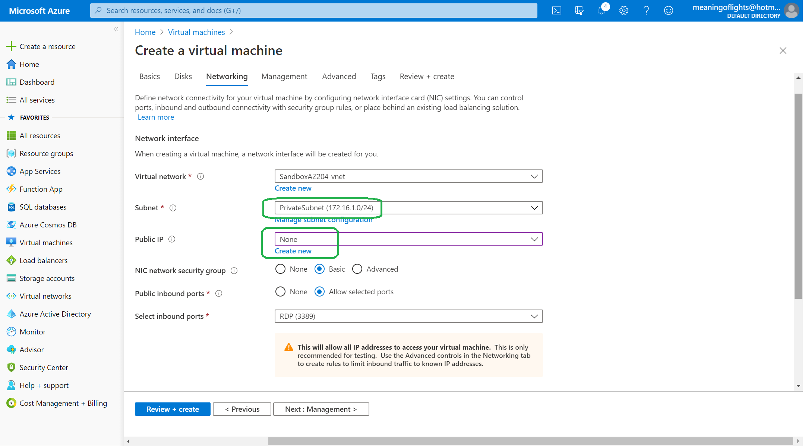
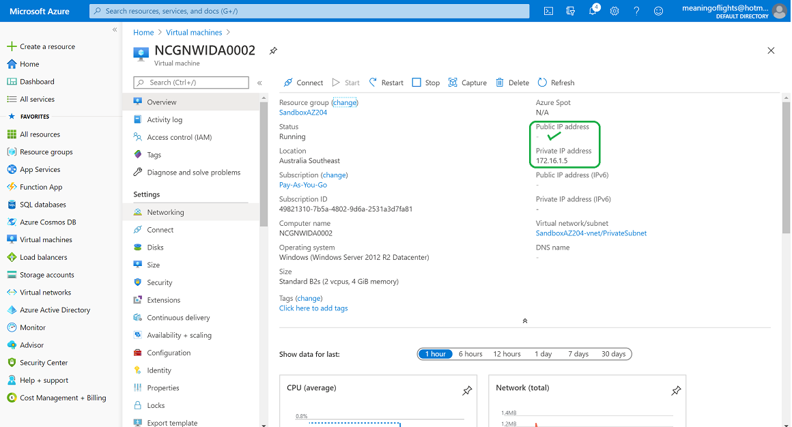
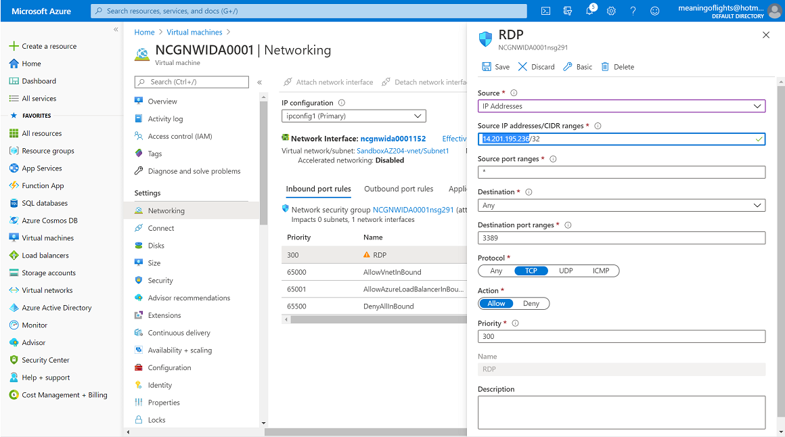
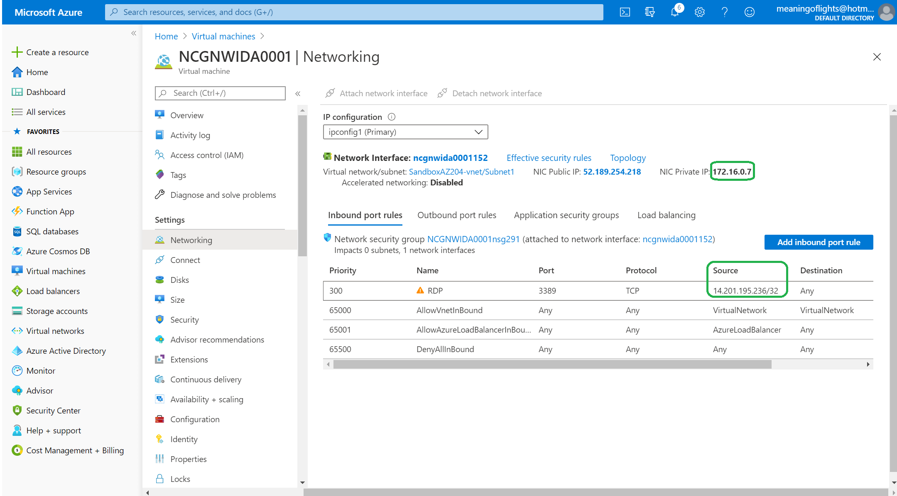
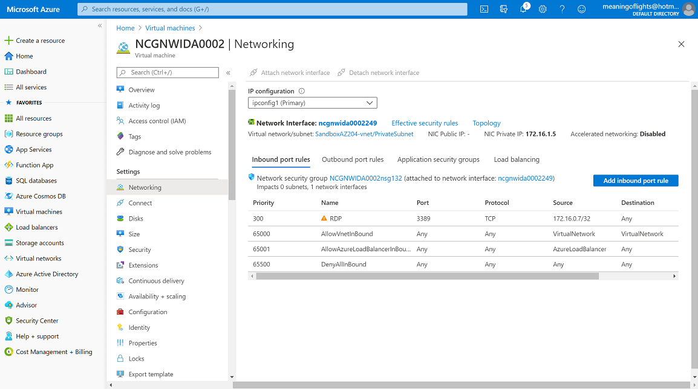
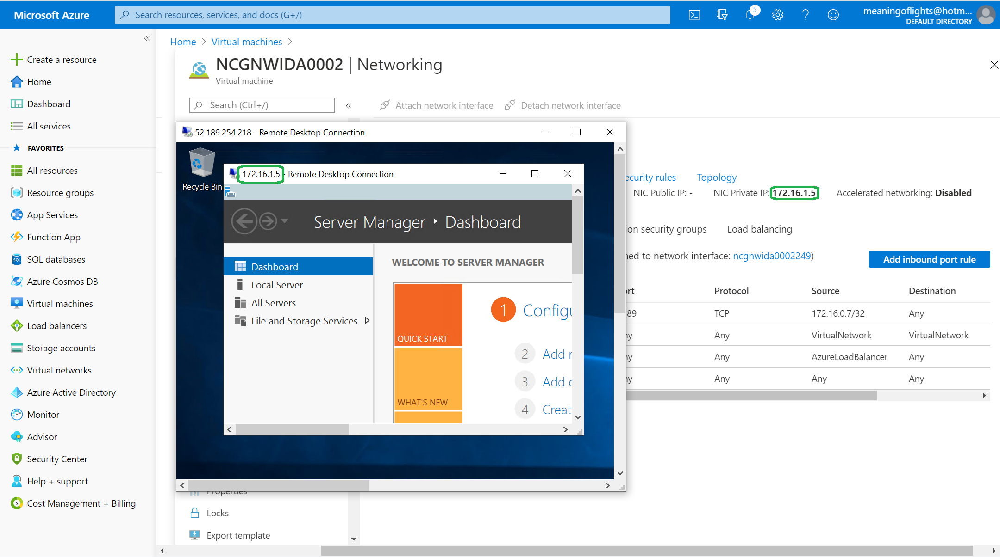

# Azure - Jump Boxes

## Purpose
At the end of this module, you will:
* Learn how to setup a Jumpbox
* Understand the purpose to provide access to a private network from public networks

## Jump boxes

A Bastion Host, known in Australia as a jumpbox is a special-purpose computer on a network typically used to access devices in a separate security zone. The most common example is managing a host in a DMZ (DeMilitarizedZone) from trusted networks or computers. This could be accessing your home network from remote location.

To clarify, this means you have one Server exposed to the internet in a Public subnet, anyone can login to that Server and then RDP or SSH into a computer on a Private subnet that only the Jumpbox can access (not the entire internet). It's a network defense to secure your systems from the internet.

### ![Create Jump Box][activity] 2.50.1 Create Jump Box

#### 2.50.2 Private Subnet

1. We will create a Private Subnet to demonstrate.

1. Click Virtual Networks on the left main menu and click the Subnets sub menu.

1. Click Add (+) Subnet.

1. Give it a name of PrivateSubnet.

1. Set the CIDR range to be 172.16.1.0/24

1. Leave all the defaults and click OK.

#### 2.50.3 Create VM in Private Subnet

1. Next we will create a new Windows VM in the Private Subnet.

1. Click Virtual Machines on the left main menu.

1. Click Add (+) Virtual Machine.

4. Name the NCGNWIDA0002

5. We need to still be able to RDP into this VM so we will need port 3389 for RDP access open.

6. Set the VMs to use PrivateSubnet and no Public IP so the machine can only be accessed via the Private IP address.

7. Create the VM and once its deployed you will see it has no Public IP Address and its in the Private Subnet.

#### 2.50.4 Lock down the Network Security Group for the Windows VM in the Public Subnet

1. Open the Windows VM NCGNWIDA0001 (the one in the Public Subnet1)

2. Select the Networking menu.

3. Select the Security Group Rule 300 RDP over 3389.

4. Set the Source drop down list to IP Addresses.

5. Google the IP Address of your machine http://google.com/search?q=my+ip+address

6. Enter your IPAddress followed by /32, for example 14.201.195.236/32

7. Copy the NIC Private Private IP address to clipboard - or to notepad.

#### 2.50.5 Lock down the Network Security Group for the Windows VM in the Private Subnet

1. Open the Windows VM NCGNWIDA0002 (the one in the Private Subnet)

2. Select the Networking menu.

3. Select the Security Group Rule 300 RDP over 3389.

4. Set the Source drop down list to IP Addresses.

5. Enter the NIC Private IP address copied from the VM in the previous step, followed by /32, for example 172.16.0.7/32

#### 2.50.6 Using a JumpBox to access a VM in a Private Subnet

1. Now it is only possible to RDP into NCGNWIDA0002 from NCGNWIDA0001, adding a layer of security.

1. Because NCGNWIDA0002 doesn't have an I_P Address you can't RDP into it.

1. Now RDP into NCGNWIDA0001, once logged in, then RDP into NCGNWIDA0002 and that will work. 

There is another way to do this and thats an Application Gateway (ie an Application Load Balancer) where you block port 80 and open 3389 on a Public IP Address.

That completes this chapter on the basics of Jump Boxes.

[activity]: ../icons/activity.png "Workshop Activity!"
[discussion]: ../icons/discussion.png "Team Discussion!"
[reading]: ../icons/reading.png "Further Reading!"
