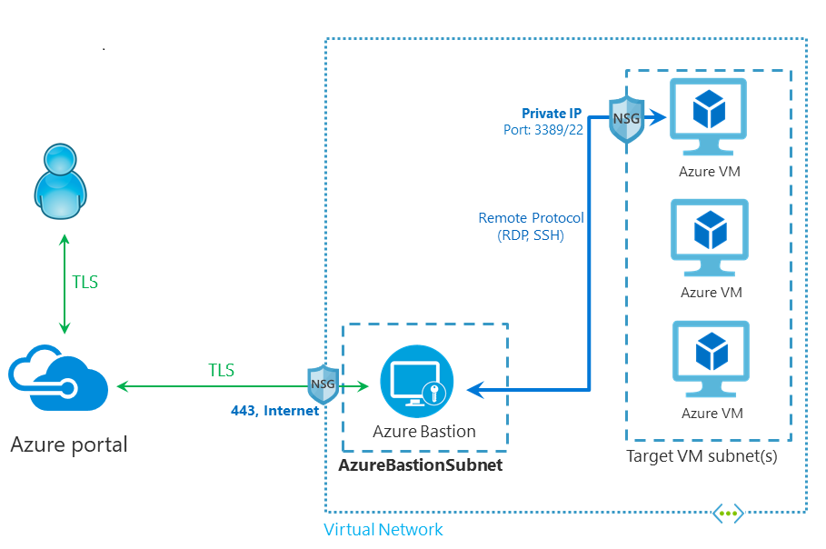
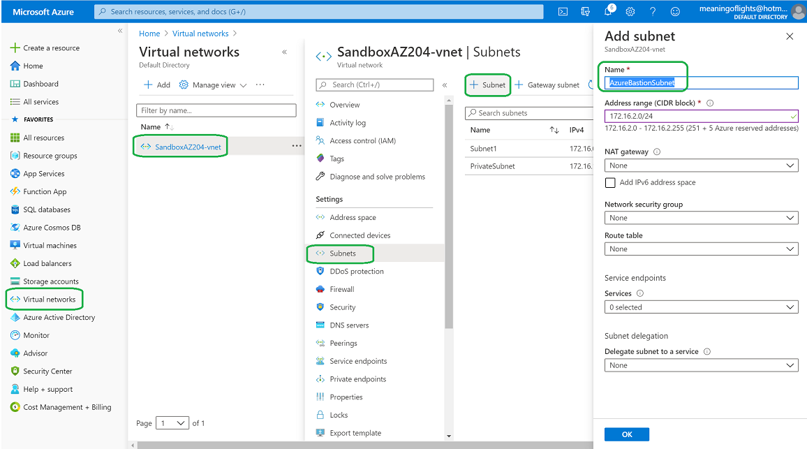
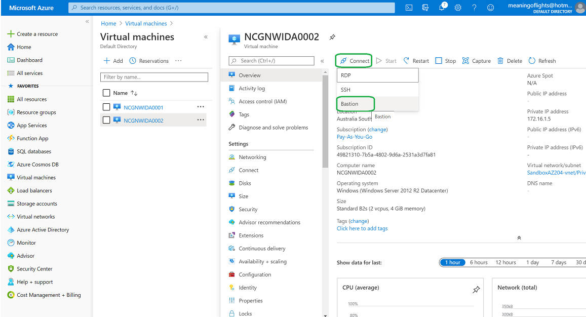
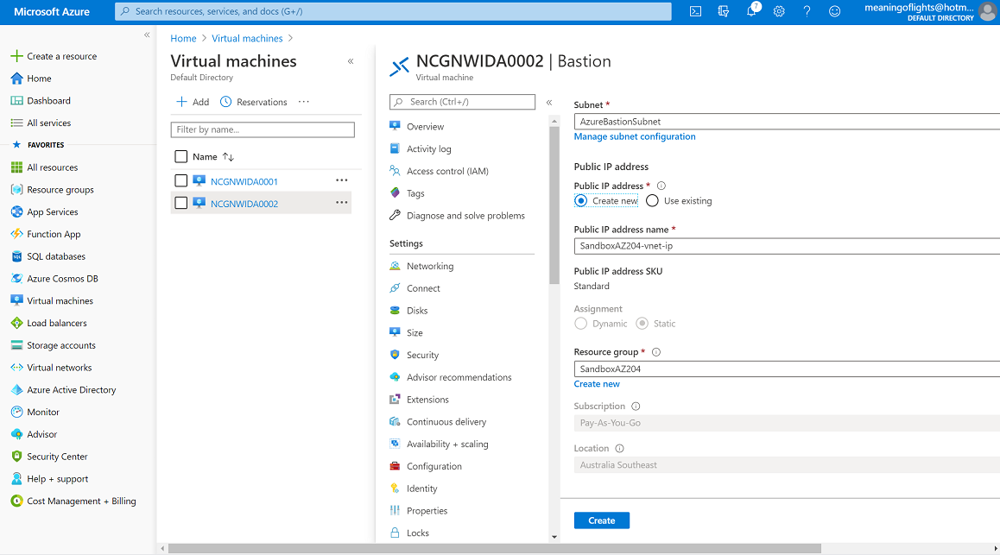
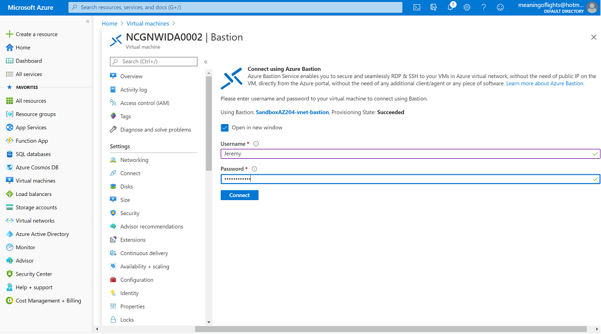

# Azure - Azure Bastion

## Purpose
At the end of this module, you will:
* Learn how to setup a Azure Bastion (a managed Jumpbox service)

### ![Create an Azure Bastion][activity] 2.55.1 Create an Azure Bastion

Azure Bastion is a new fully platform-managed PaaS service you provision inside your virtual network. It provides secure and seamless RDP/SSH connectivity to your VMs directly in the Azure portal over SSL. When you connect via Azure Bastion, your virtual machines do not need a public IP address.

#### 2.55.2 Private Subnet

1. We will create a special Subnet to demonstrate.

2. Click Virtual Networks > Subnets.

3. Click Add (+) Subnet.

4. It's critical you name it "AzureBastionSubnet".

5. Set the CIDR range as recommended.

6. Leave all the defaults and click OK.

#### 2.55.3 Create a Bastion Host

1. Navigate to the Windows VM in the Private Subnet.

1. Click Virtual Machines.

1. Click Connect > Bastion.

4. Leave the defaults and click OK (it will take 2-5 minutes).

5. Enter the Username and Password for thie VM and click OK.

NOTE: Disable Popup blocker and Allow the new window.

6. The VM is rendered in a new Web Browser window when using the Azure Bastion Host.

7. Confirm you are logged in to the VM on the private subnet. 

8. Open a Command Line Interface: Start > Run > tpye cmd press enter.

9. In the Command Prompt type ipconfig and press enter.

10. Confirm the IP addresses matches the VMs (without the need to go via a Public Subnet and Public VM you setup).

That completes this chapter on the basics of Azure Bastion.

[activity]: ../icons/activity.png "Workshop Activity!"
[discussion]: ../icons/discussion.png "Team Discussion!"
[reading]: ../icons/reading.png "Further Reading!"
