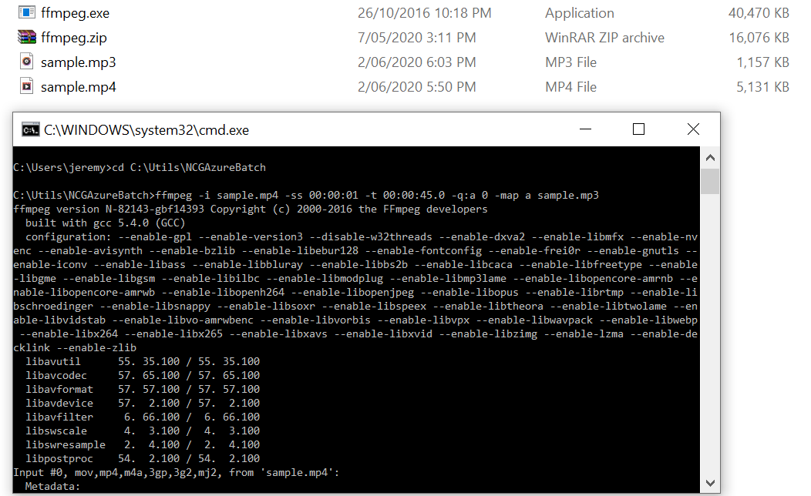

# Azure - Batch

## Purpose
At the end of this module, you will:
* Learn how to prepare a Batch Service


## Download sample files

1. Download the Sample .Net Core application and extract the Zip file contents to C:\Temp:
https://azuretrainingforncg.s3-ap-southeast-2.amazonaws.com/NCGAzureBatch.zip


## Overview of exercise

Before we go on to the Azure portal and see how you're going to work with the Azure batch service let's have a quick understanding on what we are going to do in this exercise.

We're going to create a Azure Batch Account and an Azure Storage Account.

In the Azure Storage Account we are going to be storing a video file sample.MP4,
and using a tool known as FFMPEG (to basically to convert video or audio files from one format to another) we are going to be extracting audio.

We'll associate the FFMPEG application with the Azure Batch Account. In the Azure Batch Account we're going to create a pool of one virtual machine and create something known as a job and a task. The job and task will take the sample.MP4 video file and extract a portion of audio and convert the output into a MP3 audio file. To demonstrate this we will first run it locally.



```
CD C:\Temp\NCGAzureBatch
ffmpeg -i sample.mp4 -ss 00:00:01 -t 00:00:45.0 -q:a 0 -map a sample.mp3
```

### ![Convert Video file to Audio][activity] 2.60.1 Convert Video file to Audio file locally on your PC


1. Open a command prompt (start > run > cmd)
1. CD to the directory where you extracted the zip, eg: 

```
CD C:\Temp\NCGAzureBatch
```
3. Execute the command:

```
ffmpeg -i sample.mp4 -ss 00:00:01 -t 00:00:45.0 -q:a 0 -map a sample.mp3
```

4. Check the result. Open the sample.mp3 converted file.

In the next exercise we will setup the Azure Batch job and task to take this sample.MP4 file, download FFMPEG and install the application (in this case it's just an exe but if it were an MSI it would be installed). Then we will execute the command as part of this task that will pick up the video file from our Azure Storage Account and use FFMPEG on the virtual machine extract the audio and create a new audio file.


[activity]: ../icons/activity.png "Workshop Activity!"
[discussion]: ../icons/discussion.png "Team Discussion!"
[reading]: ../icons/reading.png "Further Reading!"
