# Azure - Batch

## Purpose
At the end of this module, you will:
* Learn how to setup a Storage Account
* Learn how to setup a Storage Account Blob Containers
* Learn how to setup a Azure Batch Account
* Learn how to setup a Azure Batch Pools, Jobs and Tasks

## Using a Azure Batch Account

In the Azure Portal let's go ahead and first create a Storage Account.

#### 2.60.1 Create Stoage Account

The Storage Account will be used to store the application which is going to run on the underlying virtual machines in the Azure Batch Account. It will also be used to store the input files and the output files from the Azure Batch Account. So let's go ahead and do that!

1. Click Storage Account on the left menu.

1. Click Add (+)

1. Enter a Storage Account name, eg: namestorage123.

1. Choose the Australia Southeast region.

1. Keep the replication as locally redundant storage (LRS), as we don't need high availability for this solution since this is just a demo. 

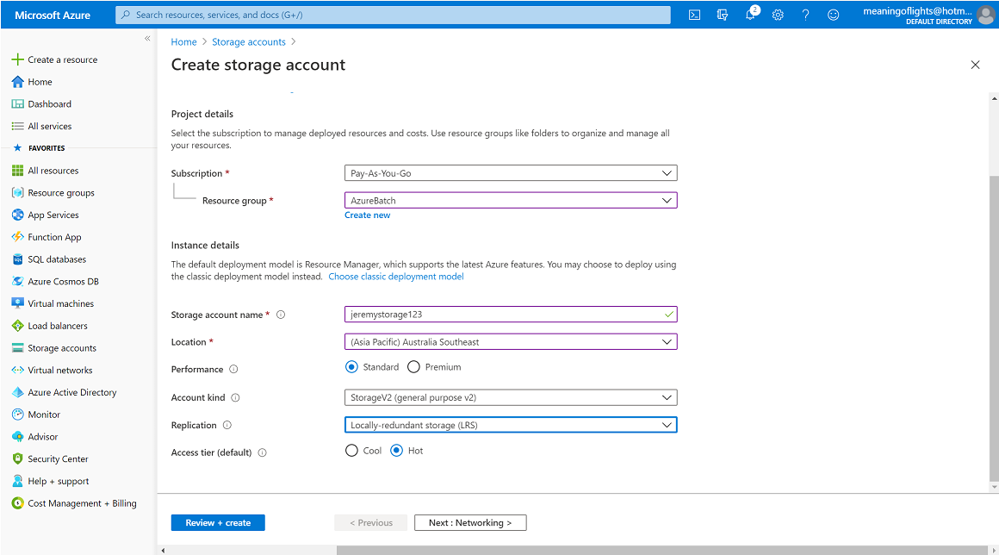

6. In the Networking and Advanced tabs leave everything as is. 
7. Click on Review and Create and then click Create for this Storage Account.

#### 2.60.2 Create Stoage Account Containers

1. Once the Storage Account is in place go to the resource.

1. Scroll down under the Blob Service menu and click Containers.

1. Create a container called input (used to store all the input files which are going to go into the Batch Account).

1. Optionally create another container called output, we won't use it in this demo (note the screenshot only shows an output folder, you need to create an Input folder).

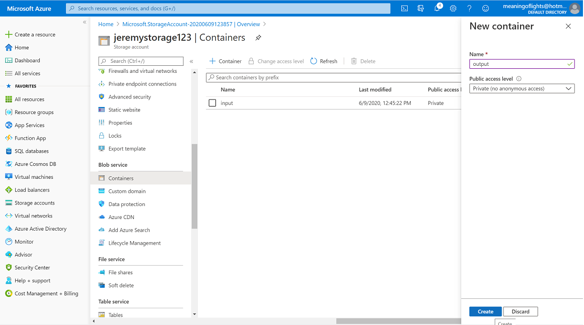

5. Go back to the input container and upload our sample.MP4 file.

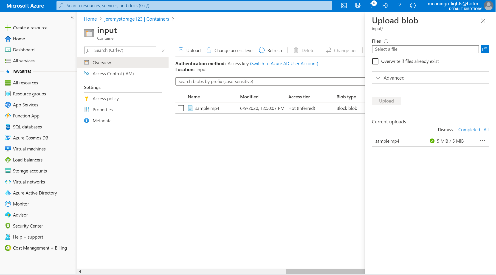

#### 2.60.3 Create Batch Account

1. Now let's go ahead and create our Azure Batch Account, in the resourcestop search bar, search and choose Batch Account (not Batch Service) and click on Create.


2. Select a resource group and give an account name. namebatch123

3. Choose the Australia SouthEast region.

4. Select the Storage Account namestorage123

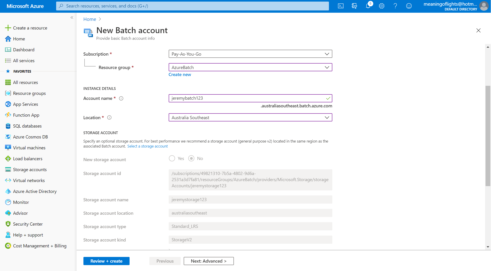

5. Click Advanced and in the pool allocation mode you have two choices; either the Batch Account or the user subscription.

* Choose the Batch Account the virtual machines used to do the processing as part of the Azure Batch Account will be managed by the account or the service itself.
* If you want to manage the virtual machines yourself you can make it part of the user subscription, leave the default as the Batch Account.

6. Don't add any tags simply click Review and Create to create the Batch Account.

#### 2.60.4 Setup the Batch Account

1. Once the Batch Account is deployed click on the Applications menu on the left hand.

* We're going to associate our video processing application FFMPEG as part of our Azure Batch Account.

> Please note you have to create a zip file out of the executable when the application is being used by the Azure Batch Account, it only accepts zip based files. Exe's or MSI's zipped up.

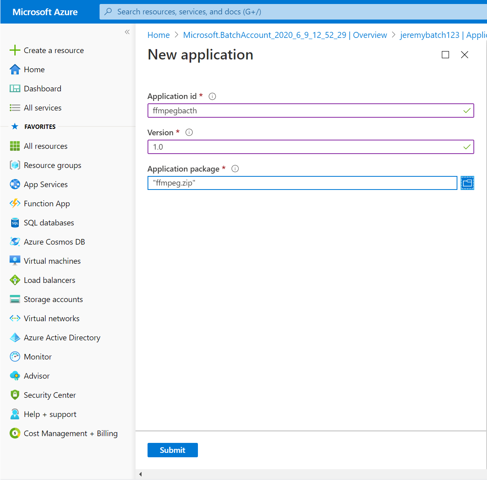

2. For an application ID enter the name: ffmpegbatch.
3. Also enter the version number for our application 1.0
4. Now we have to select our application package. Go ahead and upload the zipped FFMPEG.zip executable provided with in sample files.
5. Click on Submit.

Now our zip package is uploaded to our Storage Account and we can now see the application.

#### 2.60.5 Setup the Batch Pool

1. Click on the Pools menu under Batch Account to add a pool for our virtual machines.

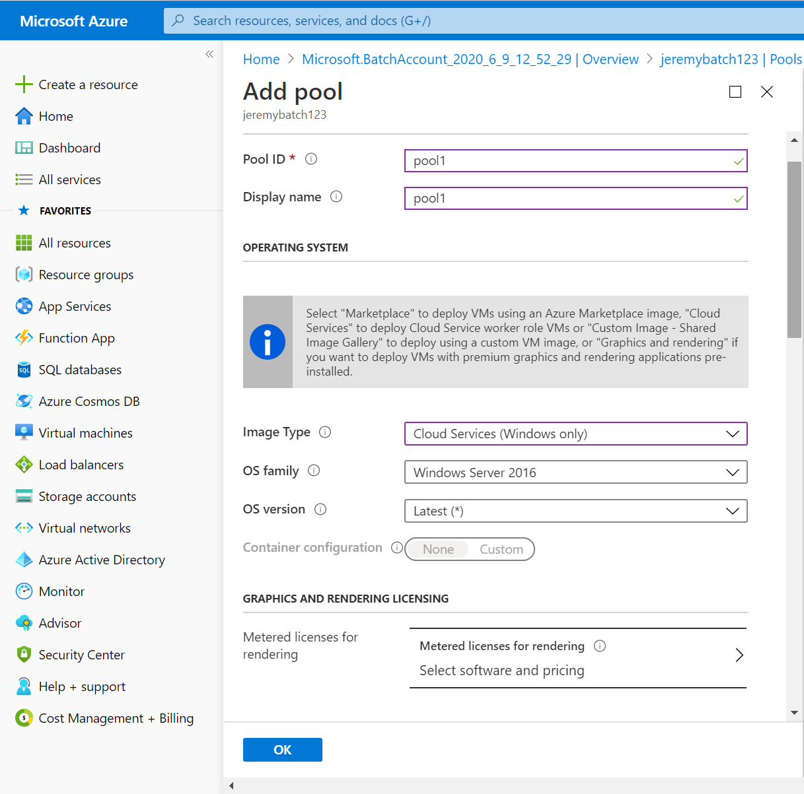

2. Click on Add
3. Specify a Pool ID: pool1
4. Image Type: Windows 2016 as the underlying image for the virtual machines 
5. Leave the size as one core and three point five GB of memory. 
6. Next specify the number of dedicated nodes (1) and the number of low priority nodes (0).

* Remember the low priority nodes are least expensive.
* If there is a shortage of resources on the Azure platform overall low priority nodes will be taken back from you.
* For the purpose of this demo I'm going to ensure that I have one dedicated node as part of my pool. If you want check out the auto scale features here. 
* If you auto scale you need to provide a formula to scale the number of virtual machines in the pool. For now I'll just leave it as fixed. 
* If you want you can decide on whether you want to have one task as a start task that will run on each node when it's created as part of the pool, for now I'll leave it as disabled.

You can see there are many other options that you can specify as part of the pool.  

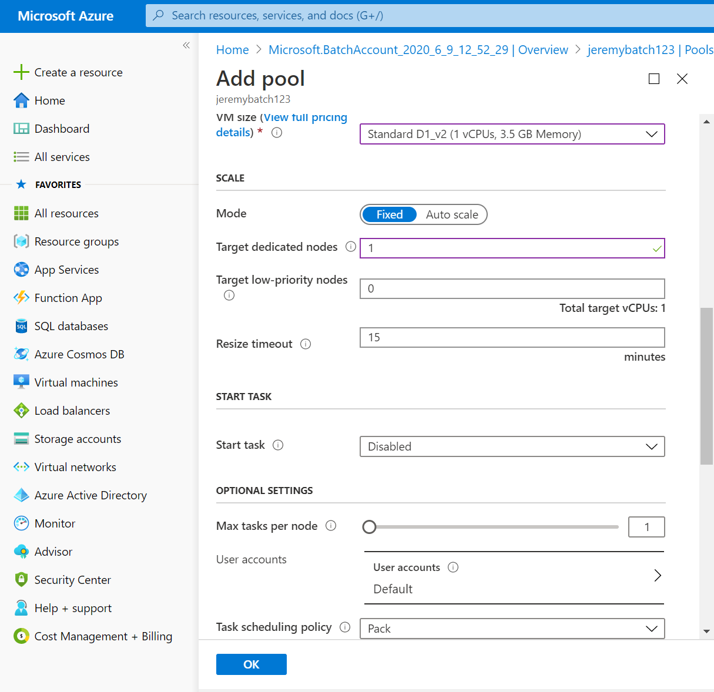

7. Specify the application packages that need to be installed in the pool of virtual machines.
8. Choose the FFMPEG application and the version of 1.0 
9. Click Select 

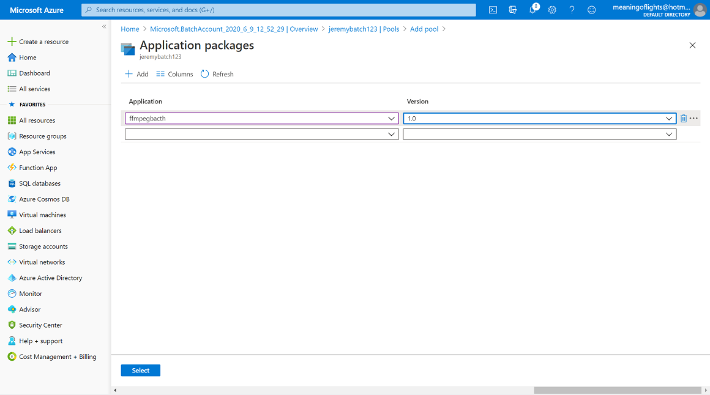

10. Finally click OK to add the pool
11. Refresh the page and you can now see that the demo pool has been created.
* You can see the allocation state is 'resizing' when it is creating the dedicated nodes. It's basically now spinning up a virtual machine as part of this pool.
* Our video processing job will then run on this virtual machine in this pool.
* Please note you can have a number of dedicated nodes and if you have multiple jobs they can run across these nodes in parallel. We have one node as part of the pool as part of our Batch Account for this demo.

12. Wait until we can see our allocation state is ready to have one virtual machine as part of our pool.

#### 2.60.6 Setup the Batch Job

1. Now click on the Jobs menu under Pools and create a job to run as part of our Batch Account.
1. Click on Add. 

3. Give the job a name or job id.

4. Select the pool.

5. Click OK to create our job.

Let's click on the job and now we can add tasks to this job.

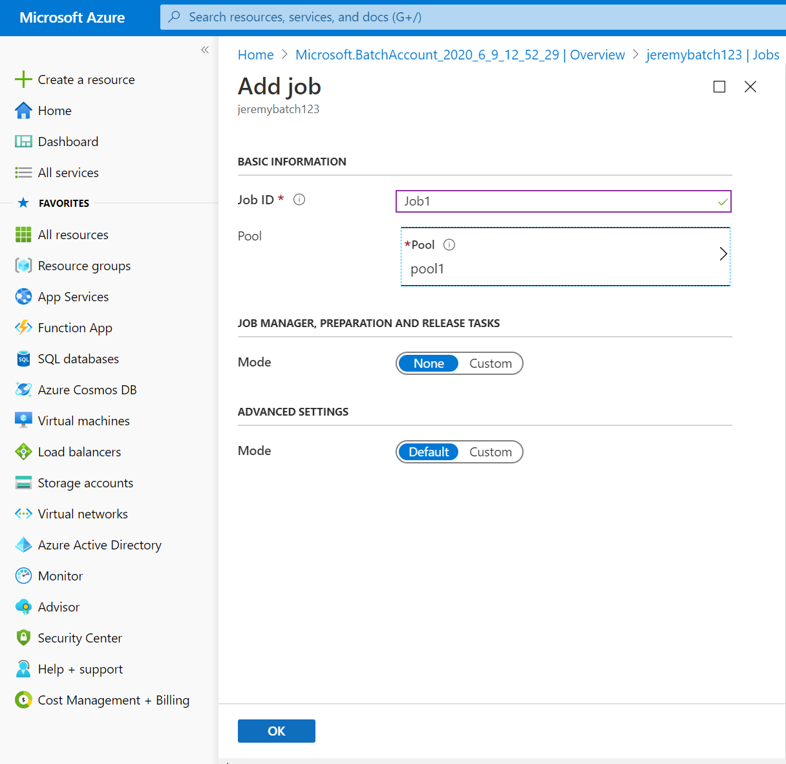

#### 2.60.7 Setup the Batch Job Tasks

We want to run a task that's going to convert the sample.MP4 file in our Storage Account blob container. 

1. Go ahead and click on add Task.

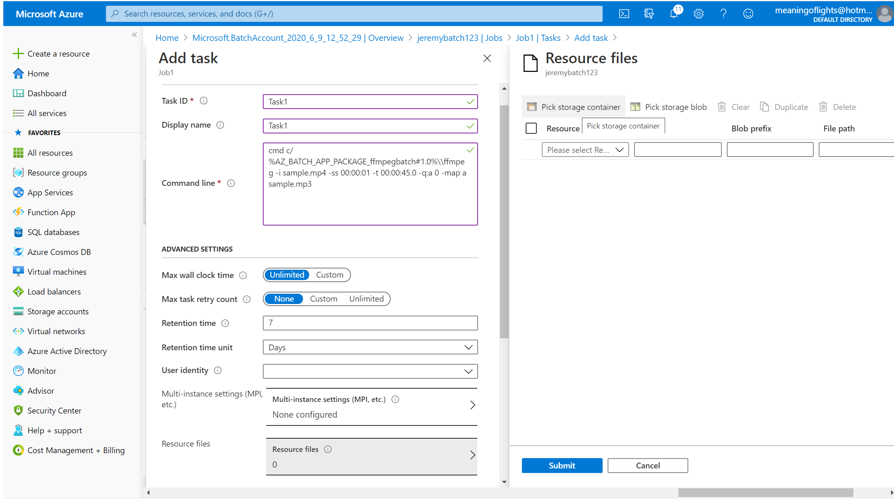

2. Let's add the task ID or just set a name for the task: Task1
3. Next is specifying the command line for what our task going to do.
4. Add this command line.

```
cmd /c
%AZ_BATCH_APP_PACKAGE_ffmpegbatch#1.0%\\ffmpeg.exe -i sample.mp4 -ss 00:00:01 -t 00:00:45.0 -q:a 0 -map a sample.mp3
```

* Let's quickly examine the above command. We reference our package in the Batch Account via the AZ_BATCH_APP_PACKAGE_ default defined constant, followed by the package id and then the version number.

Using this path we can reference the application through the command line and the rest of the command is the same as the one we ran locally on our machines previously.

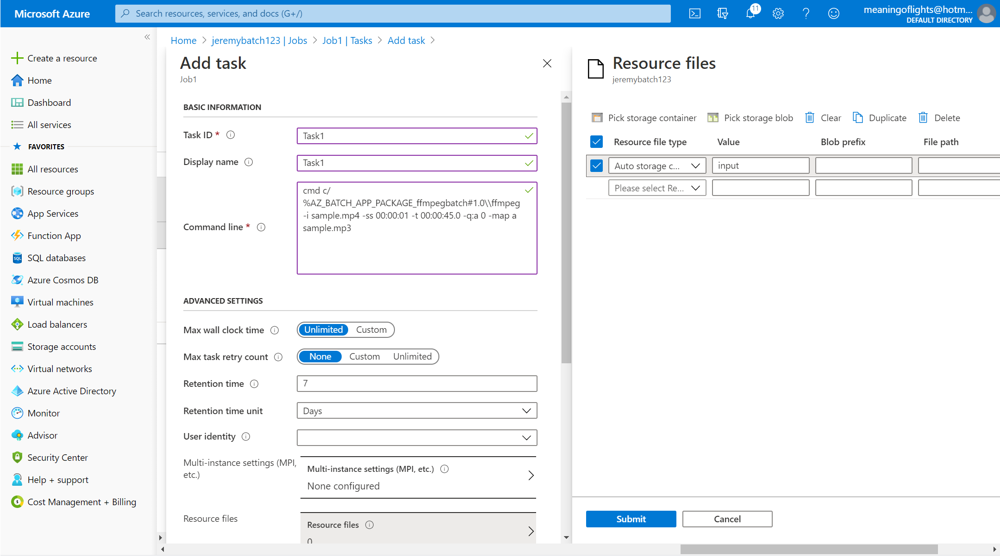

Next the Azure Batch Account task needs to get the sample.MP4 file. Remember that's in our Storage Account so we have to specify it as part of the resource file.

5. Click on Resource Files
6. Click Container

> Note that when the Azure Batch Account makes a reference to these storage container you have to make sure to use the shared access signature. This is a good security practice. In a subsequent chapter in of this course we have details of shared access signatures.

7. For now tick 'Include shared access signature' which expires in 7 days. 
8. Click OK.
9. Select the Storage Account.
10. Select the Input folder.
11. Click Select button.
12. Tick the Resource Storage Account you specified.
13. Click Submit.
14. Click Submit for the task itself.

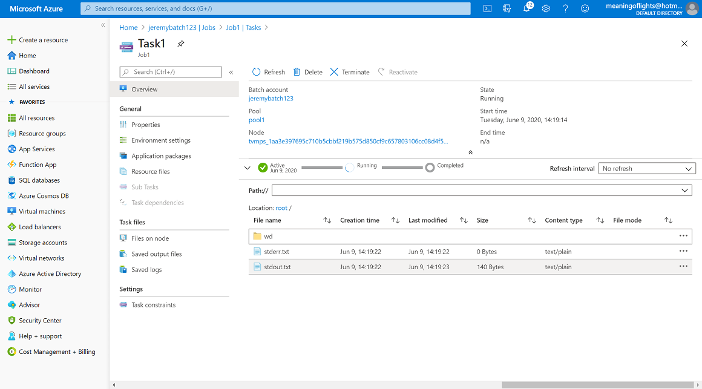

We can go ahead and click on submit for the task itself.
Now if you go ahead you can click on refresh to actually see what is the state of the task is, the task will automatically start running. 

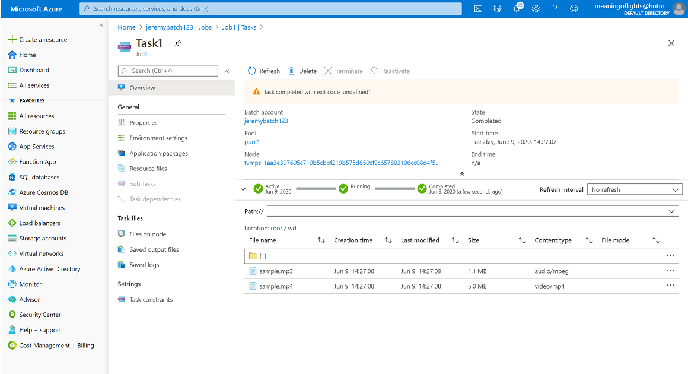

Now after about 5 or 10 seconds you can see that the state of the task is completed.

15. Click the task.

* If you go onto the menu 'Files on Node' you can now see your sample.MP3 file has been processed and download this file.

* Our task has run as desired and although we've made up our Azure Batch Account to run a single job with a single task to basically convert a video file. Remember you can expand this to create multiple jobs with multiple tasks with multiple input files.

This comcludes this chapter on how to use the Azure Batch Account from the Azure portal.


### ![Reading][reading] Further Exercise

* You can implement this Batch Account, Pool, Job and Task programmatically using the C# sample project included with the sample files.


[activity]: ../icons/activity.png "Workshop Activity!"
[discussion]: ../icons/discussion.png "Team Discussion!"
[reading]: ../icons/reading.png "Further Reading!"
