# Azure - Docker

## Purpose
At the end of this module, you will:
* Host a .Net Core app on a Linux server
* Use NGINX to point to Kestral
* Create a Containerised Web Application

## Download sample files

1. Download the Sample .Net Core application and extract the Zip file contents - "Extract Here" to C:\Temp:
https://azuretrainingforncg.s3-ap-southeast-2.amazonaws.com/dotnetCoreApp.zip


### ![Create VM to host our Container][activity] 1.73.1 VM to host our Container

In the Azure Portal we need a Linux VM to host our Container, in the second exercise 20-building-linux-vm.md we created a VM manually with NGINX installed. Let's use this server to host a .Net Web App.

#### 1.73.2 Login to Linux VM

1. Goto the VM you created in exercise 20-building-linux-vm

2. **Login using PuTTY** as described in that exercise.


#### 1.73.3 Setup Linux VM with Debian Packages and .Net Core SDK

> Note. Previously we allowed port 80 and 22 for this Linux VM.  

> Note. Previously we installed NGINX, a web server available on the linux platform, however instead of seeing the NGINX home page we want to see a .Net Core Web App.

```
sudo apt-get install -y nginx
```
Follow these steps to create a Docker Container with a .Net Core Web App on the VM:

1. Download Debian Packages using WGET
```
wget https://packages.microsoft.com/config/ubuntu/18.04/packages-microsoft-prod.deb -O packages-microsoft-prod.deb
```

2. Install Debian Packages 
```
sudo dpkg -i packages-microsoft-prod.deb
```

3. Update Operating System 
```
sudo apt-get update
```

4. Lastly install .Net Core SDK 3.1 
```
sudo apt-get install dotnet-sdk-3.1
```

#### 1.73.4 Upload the .Net Application using FTP Client 

1. Browse to C:\Temp where you extracted the files and look for a folder called publish.

1. In the Azure Portal select the Linux VM and click the Overview menu, copy its Public IP Address to the clipboard or notepad.

1.	Open your FTP Client (WinSCP) and login to the server with your username and SSH key:

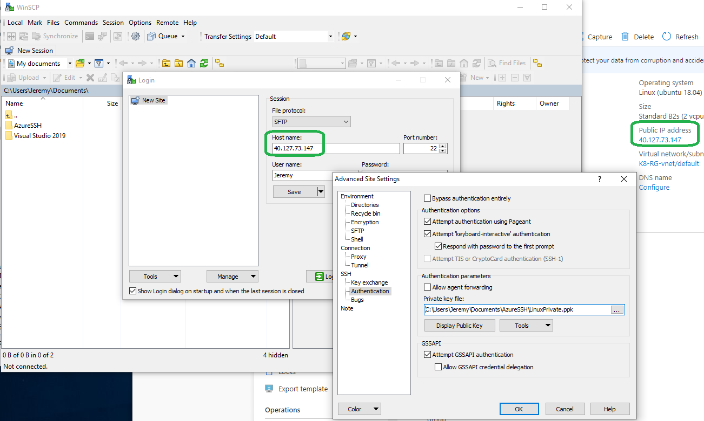

4. Locate the publish folder on the left-hand window and upload it to the server by drag dropping it to the right-hand window:

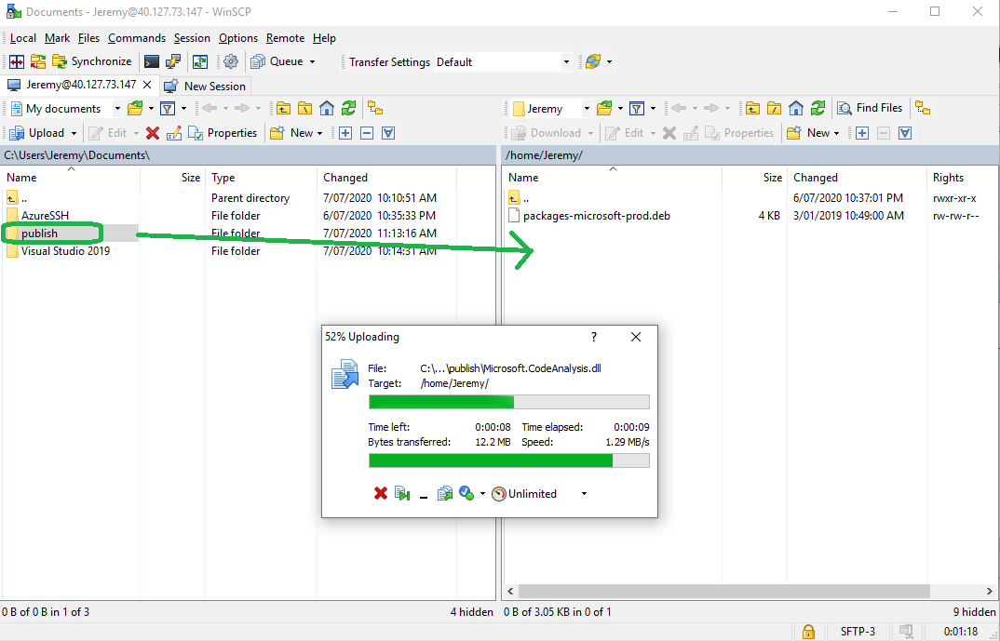

#### 1.73.5 Start up the .Net Core Web App

1. Go into the PuTTY session

2. Clear the screen

```
clear
```

3. List the contents of the Linux home directory, then change Directory to the publish folder


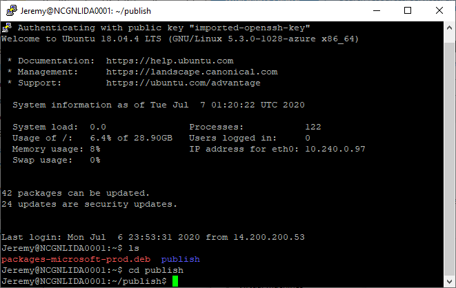


```
cd ~/publish
```

4. There is a coreproj.dll which is essentially the application's entry point. Whatever the project name is, it will be ProjectName.Dll. Using the dotnet core runtime on Linux we will start up the application. 

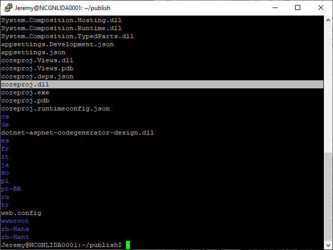

```
dotnet coreproj.dll
```


> The.Net Core websites can be run via Internet Information Services (Windows Only) and Kestral (X-Platform). Kestral isn't a full blown web host like IIS, NGINX or Apache. In this case we setup NGINX to forward requests to Kestral.

5. The web app will start listening on port 5000, however NGINX is listening on port 80 so we need to forward the requests to the Kestral server.


6. In WinSCP navigate all the way up to the root folder and then drill down to etc/nginx/sites-available/default

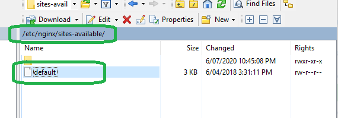

7. Duplicate the PuTTY session to configure NGINX file permission.

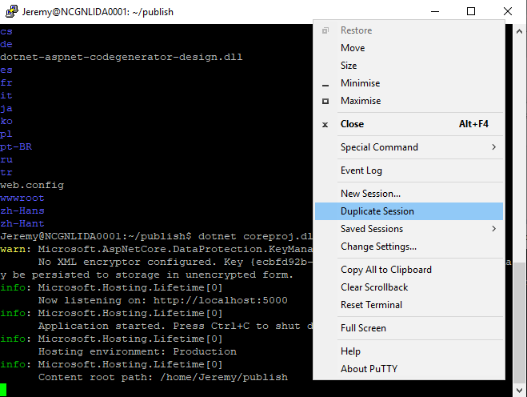


8. Change directory to etc/nginx/sites-available/ and give file permission to the default file so we can edit it:

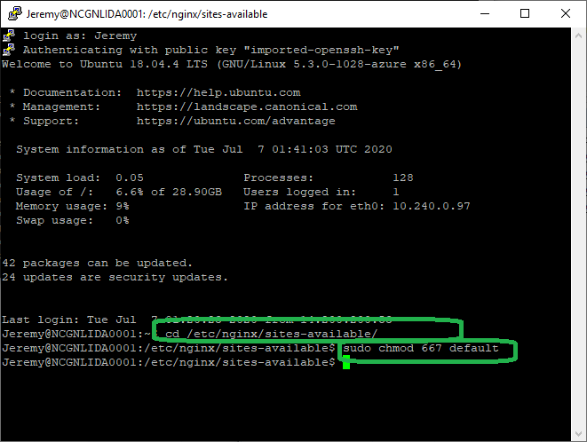

```
cd /etc/nginx/sites-available/
```


```
sudo chmod 667 default
```

9. In WinSCP open the Default file by double clicking it, paste in the following under location and remove the try_files line:


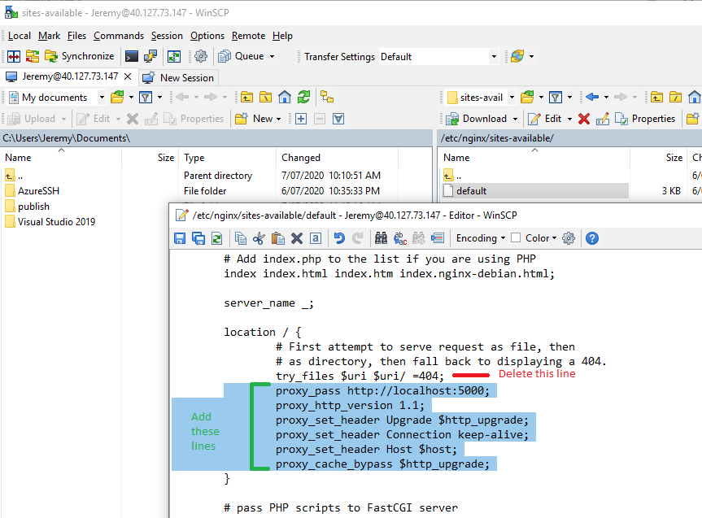

```
		proxy_pass http://localhost:5000;
		proxy_http_version 1.1;
		proxy_set_header Upgrade $http_upgrade;
		proxy_set_header Connection keep-alive;
		proxy_set_header Host $host;
		proxy_cache_bypass $http_upgrade;	
```

> Note, don't forget to remove the try_files line.

10. Save the file. You will get an error. Click Skip and then close the file. You can open it to verify your changes were saved.

12. Next we need to reload the nginx service to take in the new configuration. In the PuTTY session, issue this command:

```
sudo nginx -s reload
```

13. Finally open the web browser and browse to the Public IP Address of the VM. You will see the .Net Core app instead of the default NGINX home page.


### ![Setup a Docker container image][activity] 1.73.6 Setup the Docker container image 

1. On your Windows PC > Start > run > notepad.

2. Paste in the following:

```
FROM mcr.microsoft.com/dotnet/core/sdk:3.1
WORKDIR /app
COPY  . .
ENV ASPNETCORE_URLS http://*:5000
EXPOSE 5000
ENTRYPOINT ["dotnet", "coreproj.dll"]
```

> Whats happening is we're saying use the Microsoft dotnet SDK base image, set the working folder to be /app. The COPY command specifies everything in the same folder as the Dockerfile will be copied and the second dot means to the WORKDIR. Next we expose port 5000 and set that as the entry point for the container.

3. Save the text file as "Dockerfile" (exact case) and rename the file to remove the .txt extension.

4. Upload the Dockerfile to your linux VM using WinSCP

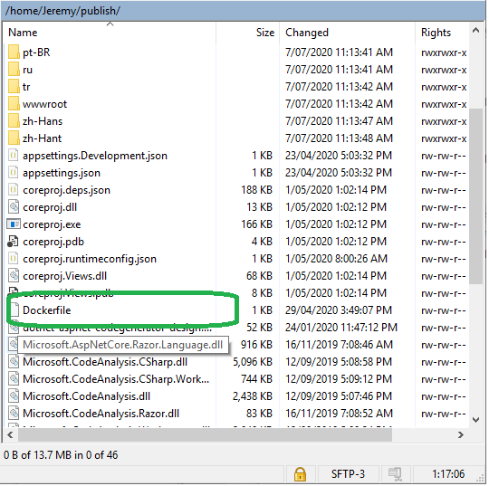

5. In PuTTY run the following install script to get docker:

```
sudo curl -SSL https://get.docker.com/ | sh
```

6. Change directory to the Publish folder and build the application into a container:

```
cd ~/publish
```

```
sudo docker build -t dotnetapp .
```

7. To check its built successfully issue a sudo docker images command:

```
sudo docker images 
```

8. Next run the Docker Container:

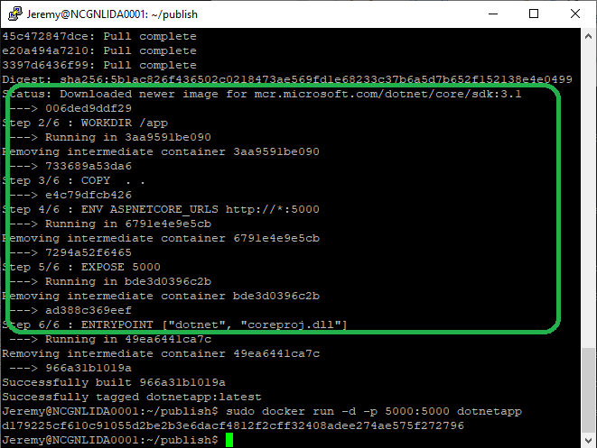

```
sudo docker run -d -p 5000:5000 dotnetapp
```

> Note: if you get an "Error starting proxy: tcp 0.0.0.0:5000: bind 5000 address already in use".

Go to the other duplicate PuTTY Session where the website is running. Press Ctrl + C to stop it running on port 5000. Re-run the above docker run command. 

> This command runs the docker container using a detached process (-d) and maps the port 5000 of the container to port 5000 of the virtual machine. This is how the requests are routed from the VM to the Container. Similar to how we mapped requests from NGINX to Kestral. The dotnetapp is the image we're specifying to run.

9. You can run this command to see all the containers running:

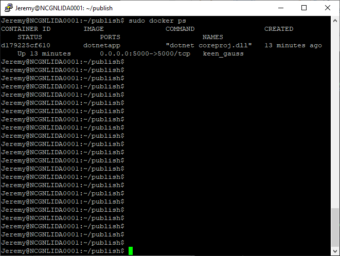


```
sudo docker ps
```

11. Finally open the web browser and browse to the Public IP Address of the VM. You will still see the .Net Core app except this time it being hosted on a Container.


#### 2.70.6 Find the Container Registry

The Azure CLI works the same on Windows as it does on Linux. We could use the CMD on our local PC, sometimes you will need to run AZ CLI commands on Linux machines and this is how we set that up.

1.	In PuTTY install the Azure CLI

```
curl -sL https://aka.ms/InstallAzureCLIDeb | sudo bash
```

#### 2.70.7 Login to Azure using the CLI

1. In PuTTY when you login to AZ if the VM can't launch a browser it will advise you to login to via the website https:/microsoft.com/devicelogin with a code to authenticate.

```
az login
```

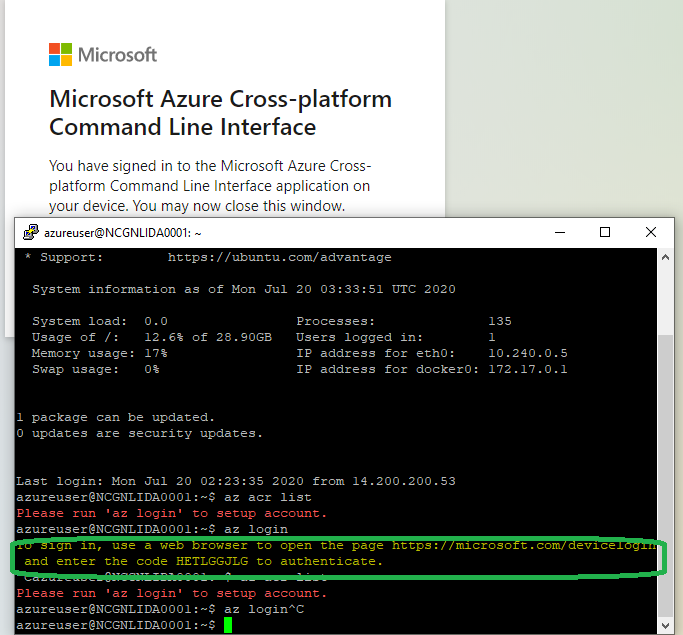

2. You will need to enter the authentication code in the web browser.

> Note: If you have problems with this, it can prompt you to AZ Login, try using a Incognito Window to reset your credentials or try an new PuTTY window, it does work! Also try https://stackoverflow.com/q/63048670/495455/

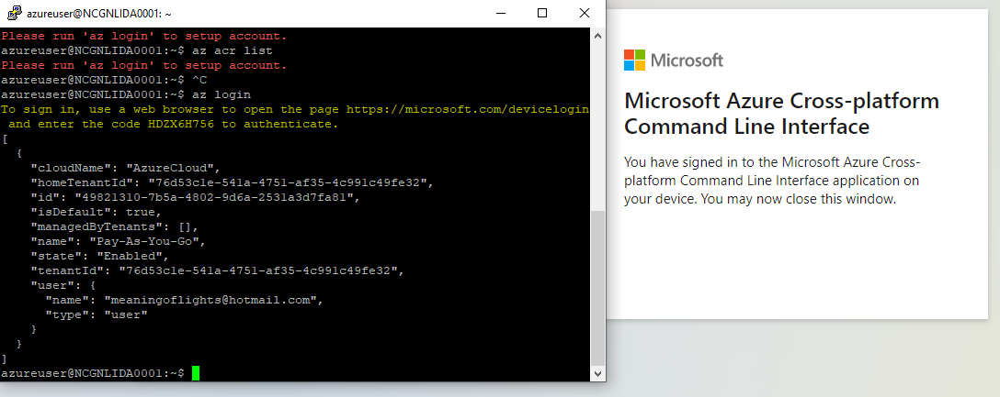

#### 2.70.7 Find the Container Registry using Azure CLI

1.	Use the following command to record the name of the most recently created container registry: 
```
az acr list
```

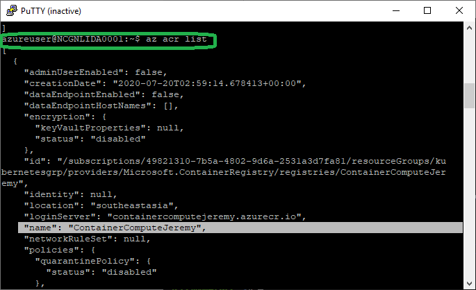


#### 2.70.8 Deploy a Docker container image to Container Registry

1. Back to change the active directory to ~/publish:
```
cd ~/publish
```

2. Use the dir command to get the contents of the current directory.

> You’ll know that you’re in the correct directory if the Dockerfile file you created earlier is there.

3. Replace the following command with your "Container Registry Name" from the previous step to upload the source code to your container registry and build the container image as a Container Registry task:

```
az acr build --registry <Container Registry Name> --image dotnetapp:latest .
```

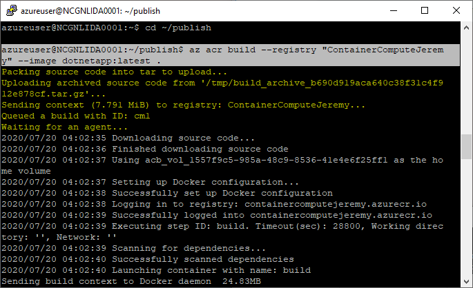


That completes this module where you created a .NET web application, added the Dockerfile file to convert the application into a Docker container image. Finally, you deployed the container image to the Azure Container Registry.


[activity]: ../icons/activity.png "Workshop Activity!"
[discussion]: ../icons/discussion.png "Team Discussion!"
[reading]: ../icons/reading.png "Further Reading!"
