# Azure - App Services

App Services is one of the most commonly used services in Azure.

## Purpose
At the end of this module, you will:
* Launch an App Service Web API
* Launch an App Services Front End Website
* Configure application settings.
* Deploy apps by using Kudu, the Azure Command-Line Interface (CLI), and zip file deployment.

## Download sample files

1. Download the Sample App Service solutions and extract it to C:\Temp:
https://azuretrainingforncg.s3-ap-southeast-2.amazonaws.com/AzureAppService.zip

## Building a web application on Azure platform as a service

### ![Build a back-end API in Azure App Service][activity] 2.90.1 Build a back-end API in Azure App Service

In the first half of this exercise we will build a back-end API that works with images as Blobs in an Azure Storage account.

#### 2.90.2 Create a Storage account

Create a new storage account with the following details:

1. New resource group: ManagedPlatform

1. Name: imgstor[yourname]

1. Location: Australia Southeast

1. Performance: Standard

1. Account kind: StorageV2 (general purpose v2)

1. Replication: Locally-redundant storage (LRS)

1. Access tier: Hot

> Wait for Azure to finish creating the storage account before you continue. You’ll receive a notification when the account is created.

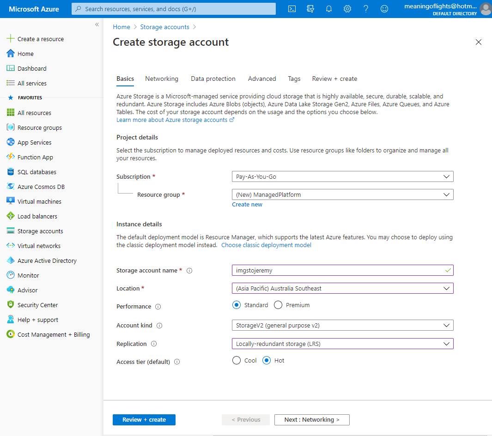

8. Access the Access Keys blade of your newly created storage account instance.

9. Record the value of the Connection String text box. You’ll use this value later in this exercise.

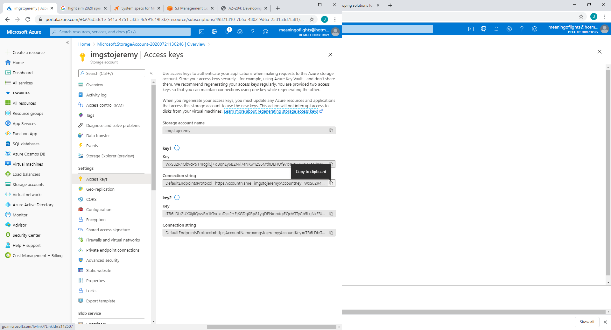


#### 2.90.3 Upload a sample blob

1. Select the imgstor[yourname] storage account that you created previously.

1. In the Blob service section, select the Containers sub menu.

1. Create a new container with the following settings:

* Name: images
* Public access level: Blob (anonymous read access for blobs only)

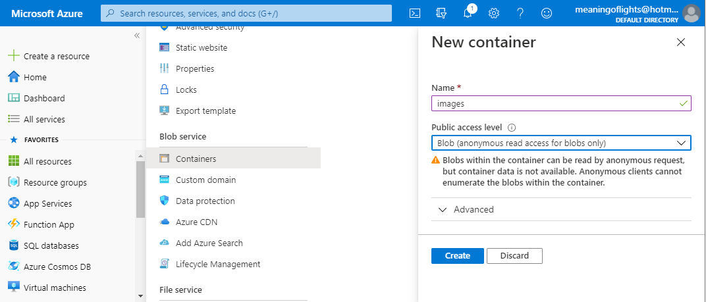

4. Go to the new images container, and then use the Upload button to upload the grilledcheese.jpg file in the c:\Temp\AzureAppService\Images folder.

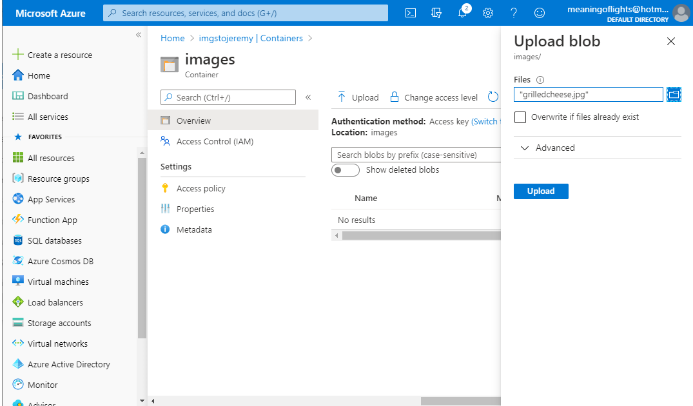

#### 2.90.4 Create a web app

Create a new web app with the following:

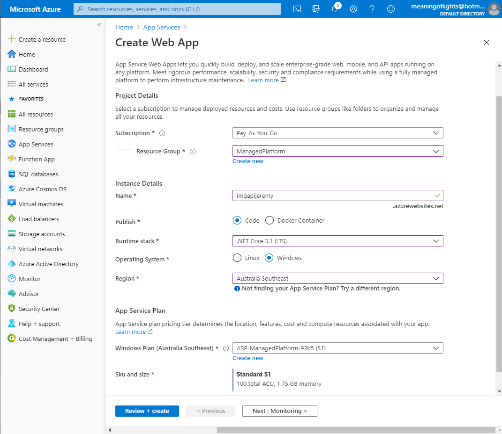

1. Select App Services from the Main menu on the left

1. Click Add

1. Existing resource group: ManagedPlatform

1. Web App name: imgapi[yourname]

1. Publish: Code

1. Runtime stack: .NET Core 3.1 (LTS)

1. Operating System: Windows

1. Region: Austraia Southeast

1. New App Service plan: ManagedPlan

1. SKU and size: Standard (S1)

1. Application Insights: Disabled

1. Click Review and Create, then click Create


> Wait for Azure to finish creating the web app before you continue. You’ll receive a notification when the app is created.

#### 2.90.5: Configure the web app

1. Go to the imgapi[yourname] web app that you created.

1. In the sub menu under Settings section, click the Configuration menu item and then create a new application setting using the following details:

* Name: StorageConnectionString
* Value: Storage Connection String copied earlier in this lab
* Deployment slot setting: Not selected

3. Click OK

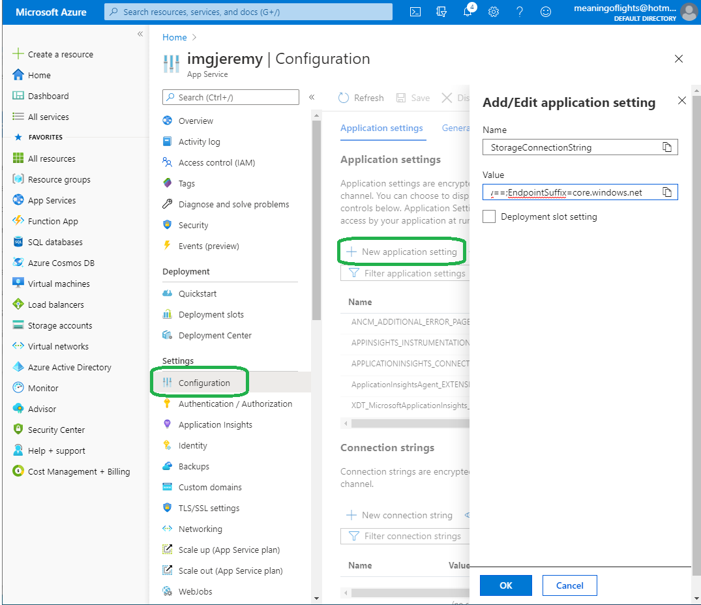

4. Save your changes to the application settings (button above the Application Settings tabs). Confirm the StorageConnectionString setting is saved.

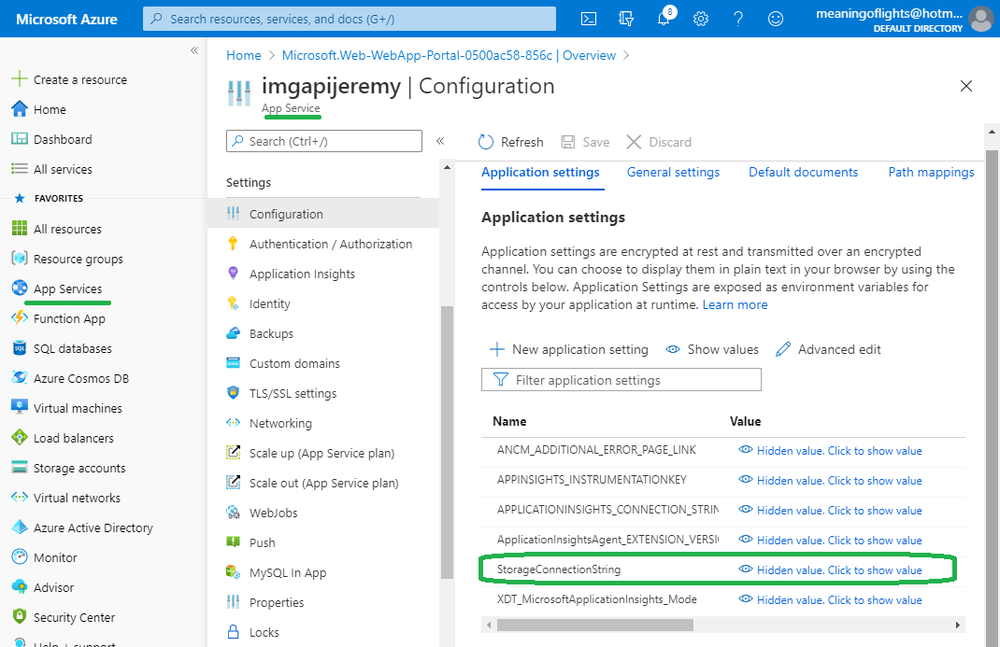

5. Click the Overview or Properties menu item.

6. Copy the value of the URL text box and record it.

> Note: At this point, the web server will return a 404 error as we have not deployed any code to the Web App yet. You will deploy code to the Web App next.

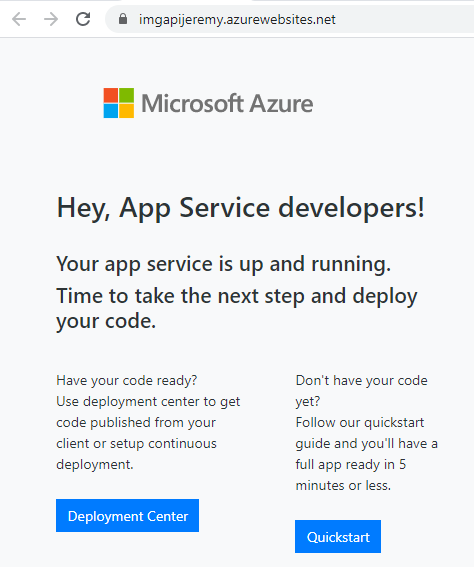


#### 2.90.6: Deploy an ASP.NET web application to Web Apps


1. Browse to the extracted download location to C:\Temp\AzureAppService and confirm the files have been extracted.

1. Using Visual Studio Code, open the web application in the c:\Temp\AzureAppService\API folder. File Menu > Open > Folder > c:\Temp\AzureAppService\API.

> Note: VSCode supports a variety of languages andtreats folders as projects so you don't open a Project File as such.

3. Now you might be prompted in VS Code to add some Extensions, go ahead and install C# and any others it recommends.

4. Open the Controllers\ImagesController.cs file, and then observe the code in each of the methods.

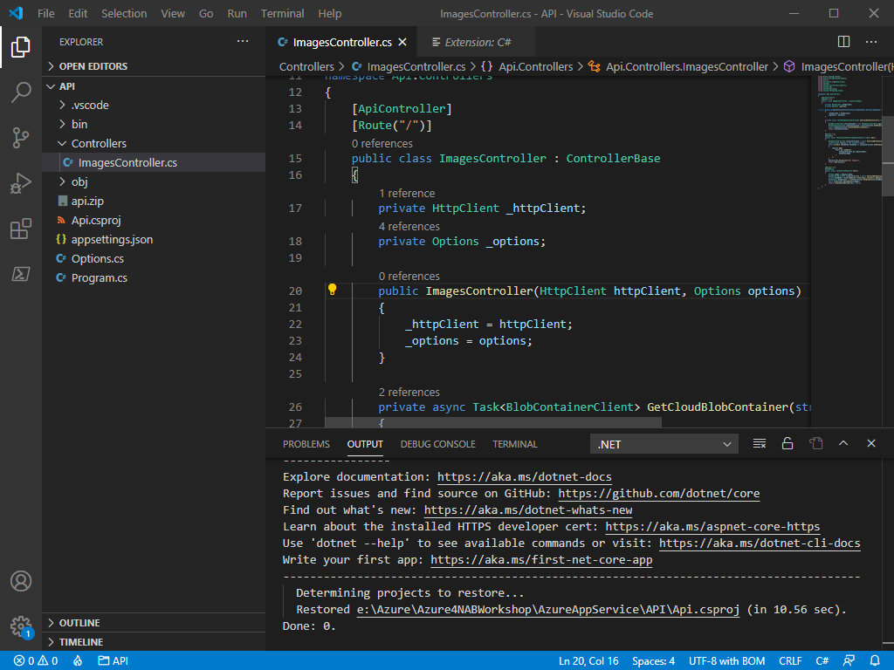

5. In VS Code open the Windows Terminal application. Terminal Menu > New Terminal.

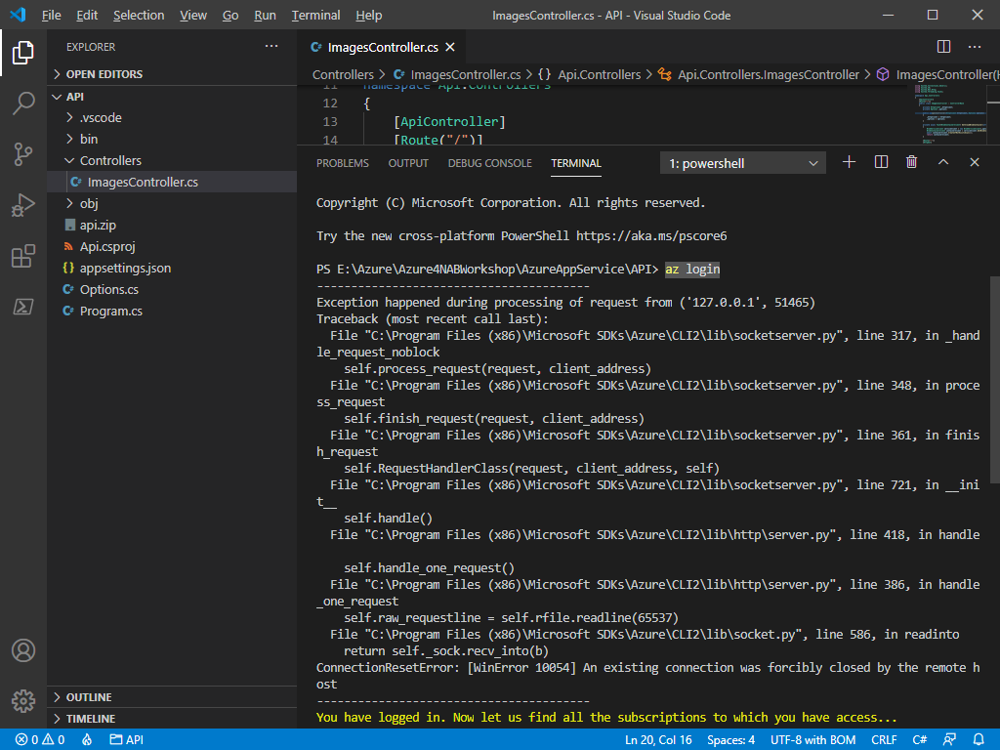

6. Sign in to the Azure CLI by using your Azure credentials:

```
az login
```


> If you get an error with az login command, make sure you installed Azure CLI and have restarted VSCode.

7. List all the apps in your ManagedPlatform resource group:

```
az webapp list --resource-group ManagedPlatform
```

8. Find the apps that have the imgapi* prefix:

```
az webapp list --resource-group ManagedPlatform --query "[?starts_with(name, 'imgapi')]"
```

9. Declare a variable $APPSERV and return only the name of the single app that has the imgapi* prefix:

```
$APPSERV=$(az webapp list --resource-group ManagedPlatform --query "[?starts_with(name, 'imgapi')].{Name:name}" --output tsv)
```

9. Change the current directory to c:\Temp\AzureAppService\API directory that contains the lab files:

```
cd c:\Temp\AzureAppService\API\
```

10. Deploy the api.zip file to the web app that you downloaded earlier:

```
az webapp deployment source config-zip --resource-group ManagedPlatform --src api.zip --name $APPSERV
```

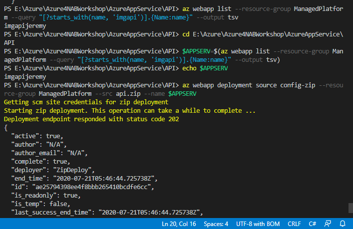

> Note: The above command uses Kudu based zip file deployment. Kudu is a service that powers continuous integration-based ZIP file deployment. 

11. Access the imgapi[yourname] web app, select the Overview and copy the URL.

12. Open the imgapi[yourname] web app in your browser. This will perform a GET request to the root of the website, and you will observe the JavaScript Object Notation (JSON) array that’s returned. This array should contain the URL for your single uploaded image in your storage account.

> Note If you get an error here, "An unhandled exception occurred while processing the request". Check that you successfully added the Storage Accounts Connection String to the App service's Application Settings in exercise: 2.90.5.


13. Close the currently running Visual Studio Code and Windows Terminal applications.

### ![Build a front-end web application in Azure Web Apps][activity] 2.90.7 Build a front-end web application in Azure Web Apps

In the second half of this exercise we will build a front-end to consume the back-end API and render images from the Azure Blob Storage account.

#### 2.90.8: Create a web app

In the Azure portal, create a new web app.

1. Select App Services from the Main menu on the left

1. Click Add

1. Existing resource group: ManagedPlatform

1. Web app name: imgweb[yourname]

1. Publish: Code

1. Runtime stack: .NET Core 3.1 (LTS)

1. Operating system: Windows

1. Region: Australia Southeast

1. Existing App Service plan: ManagedPlan

1. Application Insights: Disabled

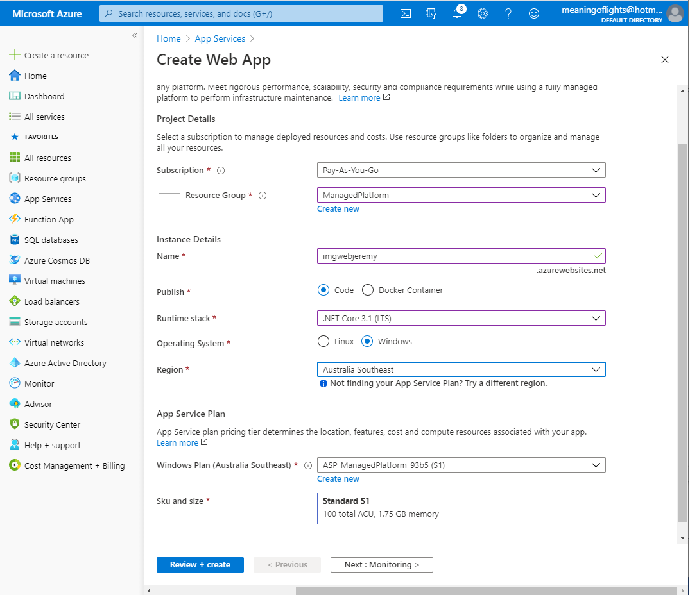

> Wait for Azure to finish creating the web app before you continue. You’ll receive a notification when the app is created.

#### 2.90.9: Configure a web app

1. Access the  web app that you created in the previous task.

1. In the imgweb[yourname] menu select Settings, click the Configuration menu item.

1. Create a new application setting by using the following details:

* Name: ApiUrl
* Value: Web app URL copied earlier in this lab
* Deployment slot setting: Not selected

> Note: Make sure you include the protocol, such as https://, in the URL that you copy into the Value text box for this application setting.

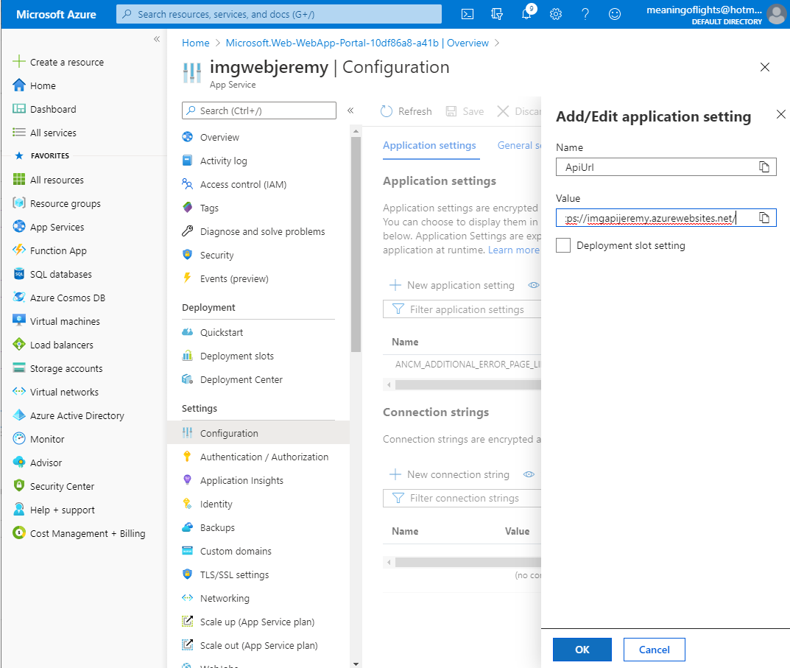

4. Save your changes to the application settings.

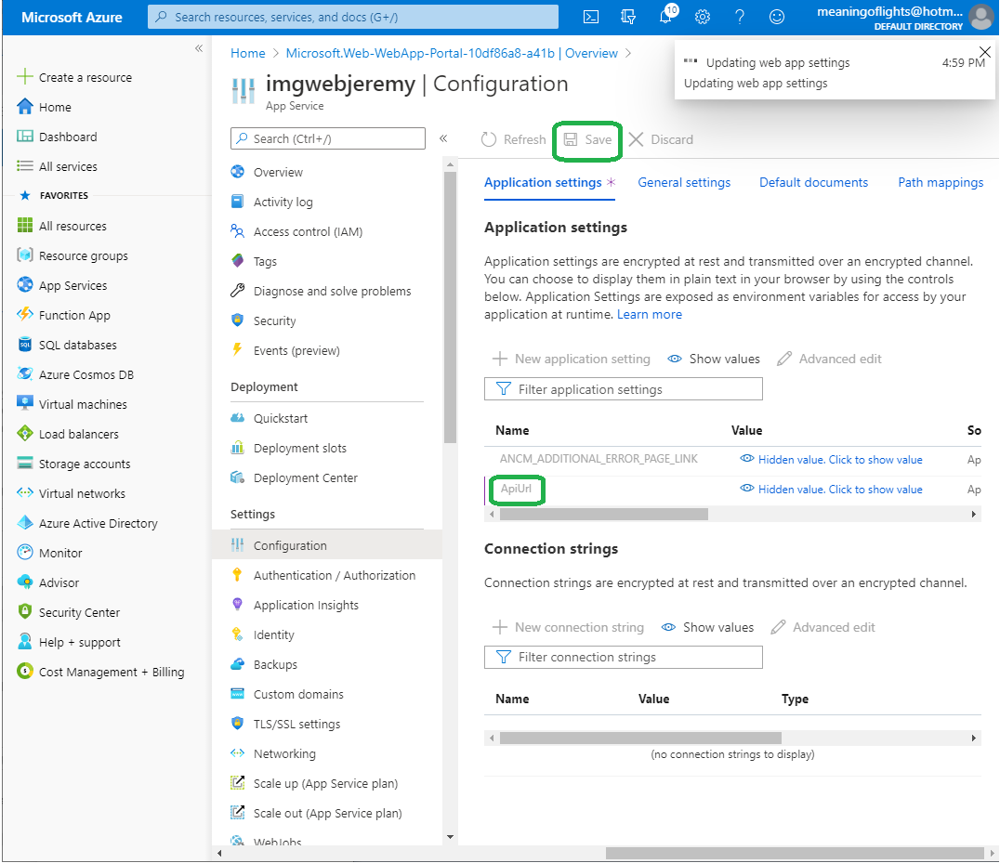

#### 2.90.10: Deploy an ASP.NET web application to Web Apps

1. Using Visual Studio Code, open the web application in the c:\Temp\AzureAppService\Web\ folder. File Menu > Open > Folder > c:\Temp\AzureAppService\Web.

2. Open the Pages\Index.cshtml.cs file, and then observe the code in each of the methods.

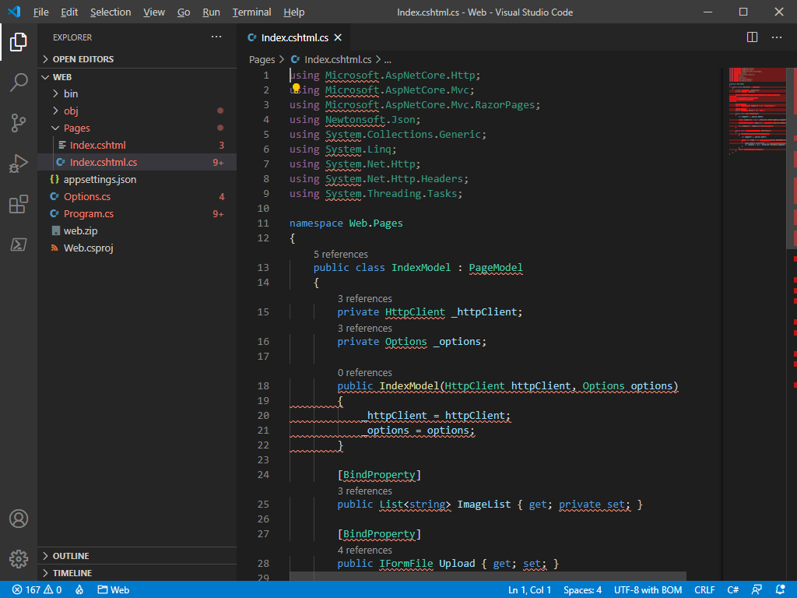


3. Open the Windows Terminal application, in Visual Studio Code > Terminal Menu > New Terminal, and then sign in to the Azure CLI by using your Azure credentials:

```
az login
```

4. List all the apps in your ManagedPlatform resource group:

```
az webapp list --resource-group ManagedPlatform
```

5. Find the apps that have the imgweb* prefix:

```
az webapp list --resource-group ManagedPlatform --query "[?starts_with(name, 'imgweb')]"
```

6. Declare a variable $APPSERV and return only the name of the single app that has the imgweb* prefix:

```
$WEBSERV=$(az webapp list --resource-group ManagedPlatform --query "[?starts_with(name, 'imgweb')].{Name:name}" --output tsv)
```

7. Change your current directory to the Allfiles c:\Temp\AzureAppService\Web\ directory that contains the lab files:

```
cd c:\Temp\AzureAppService\Web\
```

8. Deploy the web.zip file to the web app:

```
az webapp deployment source config-zip --resource-group ManagedPlatform --src web.zip --name $WEBSERV
```

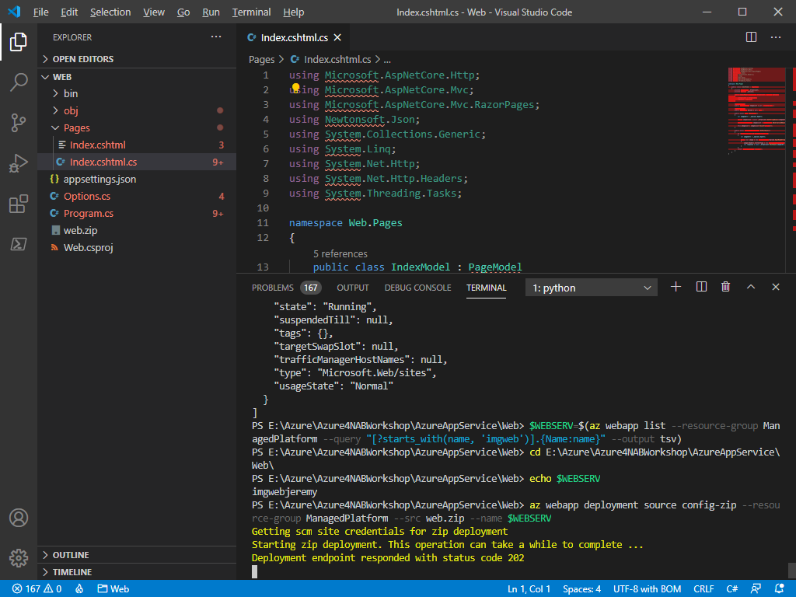

9. Access the imgweb[yourname] web app, in the Overview copy the URL and open the imgweb[yourname] web app in your browser.

10. From the Contoso Photo Gallery webpage, find the Upload a new image section, and then upload any image file in the c:\Temp\AzureAppService\Images folder on your local machine.

> Note: Ensure you click the Upload button to upload the image to Azure.

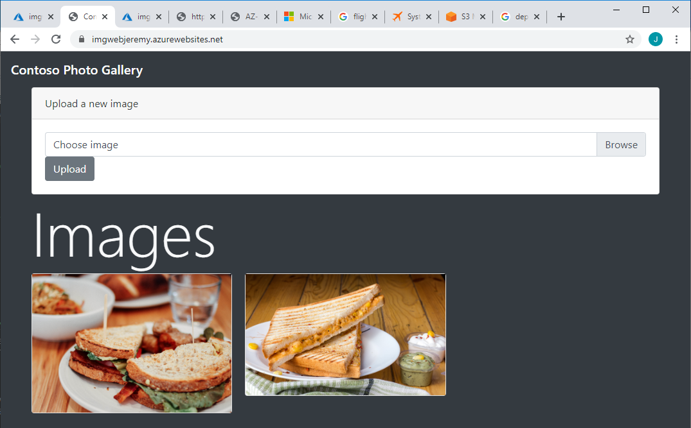

11. Observe the list of gallery images has updated with your new image.

> Note: In some rare cases, you might need to refresh your browser window to retrieve the new image.

12. Close the currently running Visual Studio Code and Windows Terminal applications.


In this exercise, you deployed a back-end ASP.NET web api application to Web Apps using the Azure CLI and the Kudu zip file deployment utility. You also deployed an Azure front-end web app and connected both web application’s configuration in the cloud.


[activity]: ../icons/activity.png "Workshop Activity!"
[discussion]: ../icons/discussion.png "Team Discussion!"
[reading]: ../icons/reading.png "Further Reading!"
